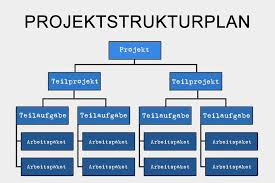

# Projektmanagement

> 📝 **Status:** In Bearbeitung

## Grundlagen

### Merkmale eines Projektes

Projekte lassen sich durch spezifische Merkmale definieren:

Jedes Projekt hat ein vorgegebenens Ziel, meist basierend auf eine Problemstellung.
Projekte kann man auch als Problemlösung für neuartige Aufgaben mot großem Spektrum sehen.
Solche Projekte werden auch meist nur einmal durchgeführt, oder können bspw. bei mehren Standorten als Blueprint dienen.

Aus der **DIN 69901-5** lässt sich folgende Definition zu einem Projekt finden:

Ein Projekt ist ein Vorhaben, das im Wesentlichen durch Einmaligkeit der Bedingungen in ihrer Gesamtheit gekennzeichnet ist.

Es kennzeichnet sich aus durch:
- Eine Zielvorgabe
- Zeitliche, finanzielle, personelle oder andere Begrenzugen
- Eine projektspezifische Organisation


## Projekt Strukturplan




Ein Strukturplan ist im Großen und Ganzen die Gliederung eines Projektes in einzelne 
Elemente.
Das Primäre Ziel ist hier, alle Elemente in planbare und kontrollierbare Teilaufgaben und 
Arbeitspakete zu zerlegen. So erhält man ein ordentlichen Gesamtüberblick des gesamten 
Projektes

Hier gibt es 3 konkrete Ansätze:
- Top-down Ansatz:
Das Projekt wird zuerst als ganzes betrachtet, dann werden einzelne 
Teilaufgaben/Teilprojekte identifiziert und definiert, woraus sich dann die Arbeitspakete 
und einzelnen Teilaufgaben festlegen.
- Bottom-Up:
Der Bottom-Up Ansatz ist entgegengesetzt dem Top-Down Ansatz. Welche 
Arbeitspakete sind Nötig, in welche Teilprojekte lassen sich diese dann definieren, um 
das Ziel des Gesamtprojektes zu erreichen bzw. dieses zu definieren?
- Yo-Yo Ansatz:
Beim Yo-Yo Ansatz wird von beiden Richtungen gleichzeitig geplant

## Lasten und Pflichtenheft

### Lastenheft:
Das Lastenheft beschreibt die Anforderungen und Erwartungen des Auftraggebers an das 
Projekt. Es legt fest, was das zu entwickelndes System oder Produkt leisten soll, ohne jedoch 
technische Details zu definieren.

### Pflichtenheft:
Das Pflichtenheft wird vom Auftragnehmer erstellt und beschreibt, wie die im Lastenheft 
definierten Anforderungen umgesetzt werden. Es enthält konkrete technische Lösungen, 
Verfahren und Vorgehensweisen, um die Anforderungen zu erfüllen.


## Netzplan

Nach DIN 69 900 ist ein Netzplan wie folgt definiert:

Ein Netzplan ist eine grafische oder tabellarische Darstellung einer Ablaufstruktur, die aus Vorgängen bzw. Ereignissen und Anordnungsbeziehungen besteht.

Ein solcher Netzplan hilft, eine Terminplanung zu bilden. Er ermöglicht es, eine Gesamtdauer des Projektes festzulegen und eine zeitliche sowie logische Abfolge der Vorgänge zu definieren. Hieraus können kritische Pfade und Vorgänge identifiziert werden, die essenziell für das geplante Projektende sind, und es hilft, Puffer und Zeitreserven zu ermitteln.

### Netzplan-Notation

```
    FAZ    FEZ
Vorgang |Beschreibung|
    | Dauer GP FP |
    SAZ    SEZ
```

### Definitionen

| Begriff | Definition |
|---------|------------|
| Vorgang | Vorgangs-ID (A, B, C, ...) |
| Dauer | Dauer in Arbeitstagen |
| FAZ | Frühester Anfangszeitpunkt |
| FEZ | Frühester Endzeitpunkt |
| SAZ | Spätester Anfangszeitpunkt |
| SEZ | Spätester Endzeitpunkt |
| GP | Gesamtpuffer (GP = SAZ – FAZ oder GP = SEZ – FEZ) |
| FP | Freier Puffer (FP = FAZ des Nachfolgers – FEZ des Vorgangs) |

### Berechnungsmethoden

**Vorwärtsrechnung:** Prozess beginnt mit dem Startpunkt des Projekts und arbeitet nach vorne.

**Beispiel:**
- Aufgabe A: 3 Tage, keine Vorgänger → FAZ = Tag 1, FEZ = Tag 3
- Aufgabe B: 5 Tage, abhängig von A → FAZ = Tag 4, FEZ = Tag 8

**Rückwärtsrechnung:** Spätester Start- und Endzeitpunkt, beginnend bei der letzten Aufgabe.

**Beispiel:**
- Gesamtdauer: 10 Tage
- Aufgabe C: 5 Tage, letzter Vorgang → SEZ = Tag 10, SAZ = Tag 6

|Vorgang | Beschreibung|
|--------| -------------|
|Dauer |GP |FP|
SAZ SEZ
Vorgang Vorgangs-ID (A, B, C ...)
Dauer Dauer in Arbeitstagen
FAZ Frühester Anfangszeitpunkt
FEZ Frühester Endzeitpunkt
SAZ Spätester Anfangszeitpunkt
SEZ Spätester Endzeitpunkt
GP Gesamtpuffer (GP = SAZ – FAZ oder GP = SEZ – FEZ)
FP Freier Puffer (FP = FAZ des Nachfolgers – FEZ des Vorgangs)
Vorwärtsrechnung: Prozess beginnt mit dem Startpunkt des Projekts, nach vorne Arbeiten

## Wichtige Begriffe

| Begriff | Definition |
|---------|------------|
| | |

## Prüfungsrelevante Inhalte

<!-- TODO: Prüfungsrelevante Punkte ergänzen -->

## Beispiele / Praxisbezug

<!-- TODO: Praktische Beispiele ergänzen -->

## Zusammenfassung

<!-- TODO: Kurze Zusammenfassung der wichtigsten Punkte -->

## Quellen

- [ ] Noch keine Quellen hinzugefügt

---
[← Zurück zur Übersicht](./README.md)
