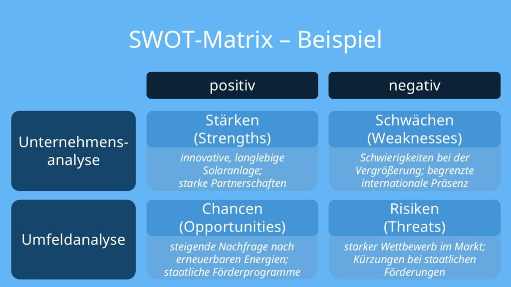

# Bedarfsanalyse

> 📝 **Prüfungsrelevanz:** AP1 + AP2
> 🔖 **Lernstatus:** ⬜ Nicht begonnen | 🔄 In Bearbeitung | ✅ Abgeschlossen

## Lernziele
- [ ] Arten der Bedarfsanalyse kennen
- [ ] Methoden der Datenerhebung anwenden
- [ ] SWOT-Analyse durchführen können

## Grundlagen

Eine Bedarfsanalyse ist der Prozess, den Bedarf an Produkten, Dienstleistungen oder ressourcen zu ermitteln im Zusammenhang mit den Zielgruppen.

Sie dient dazu, Lücken zwischen dem IST-Zustand und dem SOLL-Zustand zu schließen
Also: ermitteln des tatsächlichen Bedarfs, Gruppenanalyse usw.

## Wichtige Begriffe

| Begriff | Definition |
|---------|------------|
| Bedarfsanalyse | |
| SWOT | |
| Qualitativ | |
| Quantitativ | |

## Arten der Bedarfsanalyse

**Markbedarfsanalyse:** Bedarf im Markt oder BRanche verstehen
**Unternehmensbedarfsanalyse:** Innerhalb eines Unternehmens bspw. Ressourcenplanung & Personalbedarf
**Kundenbedarfsanalyse:** Fokus auf Kunden, Zufriedenheit maximieren und richtige Produkte anbieten

## Methoden der Datenerhebung

Eigene Datenerhebungen bedeuten, ein Unternehmen oder eine Person sammelt Daten, die für die Analyse oder Entscheidungsfindung benötigt werden.

Ein Beispiel wäre die **Kundenbefragung** ob per Online Umfrage, Telefon oder Face to Face 

### Methoden

| Art | Methoden |
|-----|----------|
| Qualitativ | Interviews (Online, Face-to-face) Befragung von Fokus / Zielgruppen, 
Beobachtung von Personen, des Marktes etc. |
| Quantitativ | Umfragen (Online, Telefonumfragen), Web Analytics (sowas wie Google 
Analytics) |

Diese Daten müssen dann auch Anhand von Statisitk oder einer Datenanalyse ausgewertet 
werden, z.B. Was sind gemeinsame Anforderungen eines Mitarbeiters an einen Arbeitsplatz? 
Welche aktuellen Trends gibt es in der Hinsicht?

## SWOT-Analyse

## Prüfungsrelevante Inhalte

<!-- TODO: Wichtige Prüfungspunkte ergänzen -->

## Beispiele / Praxisbezug

<!-- TODO: Praktische Beispiele ergänzen -->

## Zusammenfassung

<!-- TODO: Kurze Zusammenfassung -->

## Prüfungsfragen zum Üben

- [ ] Was ist eine SWOT-Analyse?
- [ ] Was ist der Unterschied zwischen qualitativer und quantitativer Datenerhebung?

## Quellen

- [ ] Noch keine Quellen

---
[↩ Zurück zur Übersicht](../README.md) | [Vorheriges Thema](01_Marktsituationen.md) | [Nächstes Thema](03_Kundenkommunikation.md)
