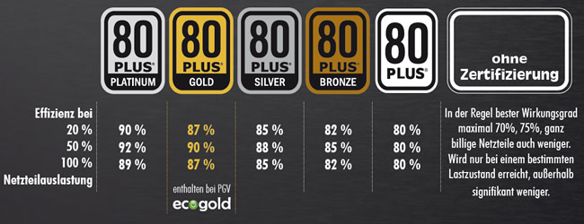

# Leistungsfähigkeit und Energieeffizienz

> 📝 **Prüfungsrelevanz:** AP1 + AP2
> 🔖 **Lernstatus:** ⬜ Nicht begonnen | 🔄 In Bearbeitung | ✅ Abgeschlossen

## Lernziele
- [ ] BIOS und UEFI unterscheiden
- [ ] CPU Kenngrößen verstehen
- [ ] RAM Typen kennen
- [ ] Dateisysteme vergleichen
- [ ] GPU/VRAM verstehen
- [ ] Ethernet-Standards kennen
- [ ] WLAN-Standards kennen
- [ ] Barrierefreiheit berücksichtigen
- [ ] Energieeffizienz bewerten
- [ ] Übertragungsraten berechnen
- [ ] Elektrotechnik Formeln anwenden

## Grundlagen

<!-- TODO: Grundlegende Konzepte ergänzen -->

## Wichtige Begriffe

| Begriff | Definition |
|---------|------------|
| BIOS | = Basic input/output Sytem - Frühere Firmware, die vor Start des Betriebssystems Hardware initialisiert. Dort kann bspw. die Boot-Reihenfolge geändert, den festplattenzugriff & overclocking einstellen |
| UEFI | = Unified Extensible Firmware interface - neuer Standart, ersetzt BIOS. Bietet einerseits support für größere Festplatten durch  GPT, generelle Standard Bootzeiten und Einstellungen wie Secureboot, TPM, Virtualiserungstechniken (Intel VT, AMD-V) und Overclocking |
| CPU | |
| RAM | |
| GPU | |
| VRAM | |

## BIOS vs UEFI

| Merkmal              | BIOS                                              | UEFI                                                                 |
|----------------------|---------------------------------------------------|----------------------------------------------------------------------|
| Startgeschwindigkeit | Langsamer Start                                   | Schnellere Bootzeiten                                                |
| Max. Partitionsgröße | Bis 2 TB (MBR)                                    | Über 2 TB möglich (GPT)                                              |
| Partitionstabelle    | MBR (Master Boot Record)                          | GPT (GUID Partition Table)                                           |
| Benutzeroberfläche   | Textbasiert, meist nur Tastatur                   | Grafisch, Mausunterstützung möglich                                  |
| Sicherheit           | Wenige Sicherheitsfunktionen                      | Secure Boot, TPM-Unterstützung, bessere Sicherheitsmechanismen        |

## CPU (Central process unit)

- taktfrequenz (GHz) - Geschwindigkeit der CPU
- Kerne: jeder Kern kann einen eigenen Befehl ausführen (multithreading)
- Threads: Virtuelle Kerne durch Hyperthreading (z.B. 4 kerne, 8 Threads)
- Cache: Schneller Zwischenspeicher - L1, L2, L3 Cache = unterschiedliche Ebenen mit unterschiedlicher Geschwindigkeit und Größe
- Architektur: (z.B. x68 oder ARM) beeinflusst Stromverbrauch, Leistung und Kompatibilität
<!-- TODO: CPU Kenngrößen ergänzen (Taktfrequenz, Kerne, Threads, Cache, TDP) -->

## RAM (Random Access Memory)

- Kapazität: max 128GB pro Modul
- Taktfrequenz: MHz DDR5 bis 6400MHz
- Latenzen: CL (Column Address Strobe Latency)

| Typ  | Taktrate         | Bandbreite         | Spannung |
|------|------------------|--------------------|----------|
| DDR3 | 800–2133 MHz     | bis 17 GB/s        | 1,5 V    |
| DDR4 | 1600–3200 MHz    | bis 25,6 GB/s      | 1,2 V    |
| DDR5 | 3200–8400 MHz    | bis 67,2 GB/s      | 1,1 V    |

## Datenspeicher (HDD vs. SSD)

**HDD (Hard Disk Drive):**
- Magnetische Platten
- langsame übertagungsraten
- günstiger bei Kapazität/Preis
- lange Lebensdauer aber mechanische Teile sehr anfällig

**SSD (solide State driver):**
- schnell und robust - keine Beweglichen tiel
- arten: NVMe, SATA-SSD, M.2
- halbleiter techniik

## Dateisysteme

| Dateisystem | Verwendung | Max. Dateigröße | Max. Partition | Betriebssysteme | Vorteile | Nachteile |
|-------------|------------|-----------------|----------------|-----------------|----------|-----------|
| FAT32 | USB-Sticks, SD-Karten | 4 GB | 8 TB | Windows, Linux, macOS | Weit verbreitet, kompatibel, einfach und schnell | Maximale Dateigröße 4 GB, kein journaling & keine Sicherheit |
| NTFS | Windows-Systeme, interne Festplatten | 16 TB | 256 TB | Windows | Unterstützt große Dateien und Volumes, Journaling, Sicherheit | Weniger kompatibel mit anderen Betriebssystemen |
| APFS | macOS & iOS | 8 Exabyte | 8 Exabyte | macOS, iOS | schneller Zugriff, Verschlüsselung & Snapshots | Nur auf Apple Geräten voll unterstützt |
| ext4 | Linux Systeme | 16 TB | 1 Exabyte | Linux | sehr stabil und weit verbreitet, Unterstützt große Dateien | Keine native Unterstützung auf Windows / macOS |
| exFAT |  | | | | | |
| exFAT | Externe Festplatten, große USB-Sticks | 16 EB | 128 PB | Windows, macOS, Linux (ab Kernel 5.4) | Unterstützt große Dateien, keine Begrenzung wie FAT32, plattformübergreifend | Kein Journaling, weniger robust als NTFS/ext4 |

## GPU/VRAM (Graphic process unit)

- **VRAM:** video RAM, Speicher für texturen und grafiken
- **CUDA-Kerne (NVIDIA):** Parallele Berechnung und bechleunigt Rechner intensive Aufgaben
- **Taktfrequenz:** Beeinflusst die Geschwindigkeit der GPU

| Speicher  | Maximale Geschwindigkeit | Vorteile                                      | Einsatzbereich                |
|-----------|-------------------------|-----------------------------------------------|-------------------------------|
| GDDR3     | bis 8 Gbit/s            | Geringe Latenz, niedriger Energieverbrauch    | Ältere Grafikkarten, Embedded |
| GDDR4     | bis 12 Gbit/s           | Höhere Bandbreite als GDDR3                   | Selten, Übergangstechnologie  |
| GDDR5     | bis 28 Gbit/s           | Hohe Bandbreite, weit verbreitet              | Mainstream-Grafikkarten       |
| GDDR5X    | bis 56 Gbit/s           | Noch höhere Bandbreite, effizienter           | High-End-Grafikkarten         |
| GDDR6     | bis 64 Gbit/s           | Sehr hohe Bandbreite, effizient, Standard     | Aktuelle Grafikkarten         |
| GDDR6X    | bis 84 Gbit/s           | Extrem hohe Bandbreite, optimiert für Gaming  | High-End/NVIDIA RTX Karten    |

## Netzwerkkarten (NIC)
- **wired (Ethernet)**
    - 10/100/1000Mbps (Gigabit Ethernet)
    - 10G Ethernet für sehr hohe Bandbreiten
- **Wireless (WLAN)**
    - WLAN 802.11 a/b/g/n/ac/ax = WLAN-Standarts

## Router, Switches & Gateways

- **Router:** Verbindet Netzwerke und leiten den Datenverkehr zwischen ihnen
- **Switches:** Verbindet mehrere Geräte innerhalb eines lokalen Netzwerks (LAN), verwaltet den Datenverkehr effizient
- **Gateway:** Ein Vermittler zwischen verschiedenen Netzwerken oder Protokollen

## Lichtwellenleiter (LWL)

- **Single-Mode:** Schnelle, lange Distanzen (z.B. für Glasfaser Datenzentren)
- **Multi-Mode:** Kürzere Distanzen und Kostengünstiger

## Netzwerkstandarts

**Ethernet:** Die **Kabelgebundenen Netzwerkstandarts (Ethernet)** sind weit verbreitet in LANs und bieten verschiedene Geschwindigkeiten von **10 Mbps** (für ältere Systeme) bis zu **100 Gbps** (für moderne Rechenzentren). Die **maximale Kabellänge** variiert je nach standard und kabeltyp.

**WLAN(Wi-Fi):** Die **drahtlosen Netzwerkstandards** ermöglichen Kabellose Verbindungen. **Wi-Fi 6** (802.11ax) ist der neueste Standart, der höhere Geschwindigkeiten und bessere Effizienz in überlasteten Netzwerken bietet. **Wi-FI 6E** nutzt den neuen **6 GHz-Bereich**, was für weniger Interferenzen sorgt.

### Ethernet-Standards

| Standard | Geschwindigkeit | Verkabelung | Maximale Kabellänge | Verwendungsbereich |
|----------|----------------|------------|----------|---|
| Ethernet (10BASE-T) | 10 Mbps | Kupfer (Cat5 ooder höher) | 100 Meter | Frühe Netzwerke, alte Systeme |
| Fast Ethernet (100Base-T) | 100 Mbps | Kupfer (Cat5 ooder höher) | 100 Meter | Ältere Netzwerke, Home office|
| Gigabit Ethernet (1000BASE-T) | 1 Gbps | Kupfer (Cat5e ooder höher) | 100 Meter | Standart in modernen LANs|
| 10 Gigabit Ethernet (10GBASE-T) | 10 Gbps | Kupfer (Cat6a oder Cat7) | 55-100 Meter | High-End-Gaming, datacenter |
| 40 Gigabit Ethernet (40GBase-T) | 40 Gbps | Kupfer (Cat8) | 30 Meter | Rechenzentren, Enterprise-Bereich|
| 100 Gigabit Ethernet (100GBase-T) | 100 Gbps | Kupfer (Cat8) | 30 Meter | Hochleistungs-Datenzentren |

### WLAN-Standards

| Standard | Frequenz | Max. Geschwindigkeit | Verwendungszweck |
|----------|----------|---------------------|------------|
| 802.11n (Wi-Fi 4) | 2,4 GHz, 5GHz | bis zu 600 Mbps | ältere Router, Basis-WLAN-Netzwerke |
| 802.11ac (Wi-Fi 5) | 5 GHz | bis zu 3,5 Gbps | Moderne Heimnetzwerke, Gaming & Streaming |
| 802.11ax (Wi-Fi 6) | 2,4 GHz, 5 GHz, 6 GHz | bis zu 9,6 Gbps | High-Speed-Internet, Smart Homes |
|Wi-Fi 6E| 2,4 GHz, 5 GHz, 6 GHz | bis zu 9,6 Gbps | Erweiterte Nutzung des 6 GHz-Bereichs für weniger Interferenzen |
| 802.11be (Wi-Fi 7) | 2,4 GHz, 5 GHz, 6 GHz | bis zu 30 Gbps | zukünftige Netzwerke, ultra-schnelle Anwendungen |

## Barrierefreiheit

> **Barrierefreier Zugriff auf IT-Systeme am Arbeitsplatz**  
> Der barrierefreie Zugriff auf IT-Systeme am Arbeitsplatz ist essenziell, um Menschen mit Einschränkungen die uneingeschränkte Nutzung von Hard- und Software zu ermöglichen. Durch verschiedene Einstellungsmöglichkeiten können Webseiten und Betriebssysteme individuell angepasst werden.

**Zu den wichtigsten Funktionen gehören:**
- **Zoom-Funktionen** zur Vergrößerung von Texten
- **Hohe Kontrastmodi** und **Farbfilter**
- **Anpassung von Schriftarten und -größen** für bessere Lesbarkeit

**Weitere wichtige Aspekte:**
- Unterstützung von **Screenreadern** wie NVDA oder JAWS
- Möglichkeit, **Webseiten vollständig über die Tastatur** zu bedienen

**Barrierefreie Funktionen in Betriebssystemen (z. B. Windows, macOS, Linux):**
- Sprachausgabe
- Bildschirmtastaturen
- Diktierfunktionen

**Spezielle Hardwarelösungen:**
- Ergonomische Eingabegeräte
- Braillezeilen

**Standards und Richtlinien:**
- **WCAG** (Web Content Accessibility Guidelines)
- **BITV 2.0**

Diese Maßnahmen stellen sicher, dass IT-Systeme möglichst barrierefrei gestaltet werden. So wird gewährleistet, dass alle Mitarbeitenden – unabhängig von ihren individuellen Einschränkungen – effizient und gleichberechtigt arbeiten können.
 

## Energieeffizienz-Gütesiegel

<!-- TODO: Gütesiegel ergänzen (Energy Star, EU-Energielabel, Blauer Engel, etc.) -->

## Übertragungsraten

Bei der digitalen Datenübertagung spielen **Übertragungsraten und -zeiten** eine wichtige Rolle. Die Übertagungsrate wird meist in **Megabit pro Sekunde (Mbit/s)** oder **Gigabit pro Sekunde (Gbits/s)** angegeben und beschreibt die Menge an Daten, die pro Sekunde übertragen werden, kann. Die tatsächliche Übertragungszeit hängt von der verfügbaren Bandbreite sowie der Größe der zu übertragende Datei ab.

**Es gibt zwei unterschiedliche Systeme zur Angabe von Speichergrößen:**

**Dezimalsystem (SI)**
*vielfaches von 1.000 (Basis 10)*

- 1 Kilobyte (KB) = 1.000 Byte
- 1 Megabyte (MB) = 1.000 KB = 1.000.000 Byte
- 1 Gigabyte (GB) = 1.000 MB = 1.000.000.000 Byte
- 1 Terabyte (TB) = 1.000 GB = 1.000.000.000.000 Byte

**Binärsystem (IEC)**
*vielfaches von 1.024 (Basis 2)*

- 1 Kibibyte (KiB) = 1.024 Byte
- 1 Mebibyte (MiB) = 1.024 KiB = 1.048.576 Byte
- 1 GiBibyte (GiB) = 1.024 MiB = 1.073.741.824 Byte
- 1 tebibyte (TiB) = 1.024 GiB = 1.099.511.627.776 Byte

**Die Berechnung der Übertragungszeit:**

$$ Zeit(s) = \frac{Datenmenge(Bit)}{Übertragungsrate(Bit/s)} $$

## Elektrotechnik Formeln

| Größe | Formel | Einheit |
|-------|--------|---------|
| Spannung (U) | U = R × I | Volt (V) |
| Stromstärke (I) | I = U / R | Ampere (A) |
| Widerstand (R) | R = U / I | Ohm (Ω) |
| Leistung (P) | P = U × I | Watt (W) |
| Energie (E) | E = P × t | Wattstunde (Wh) |

## Prüfungsrelevante Inhalte

<!-- TODO: Wichtige Prüfungspunkte ergänzen -->

## Beispiele / Praxisbezug

<!-- TODO: Praktische Beispiele ergänzen -->

## Zusammenfassung

<!-- TODO: Kurze Zusammenfassung -->

## Prüfungsfragen zum Üben

- [ ] Was sind die Unterschiede zwischen BIOS und UEFI?
- [ ] Welche Dateisysteme kennen Sie und wofür werden sie eingesetzt?
- [ ] Was ist der Unterschied zwischen DDR3, DDR4 und DDR5 RAM?
- [ ] Wie berechnet man die elektrische Leistung?

## Quellen

- [ ] Noch keine Quellen

---
[↩ Zurück zur Übersicht](../README.md) | [Vorheriges Thema](02_Einsatzbereiche_IT_Systeme.md) | [Nächstes Thema](04_Wirtschaftlichkeit.md)
