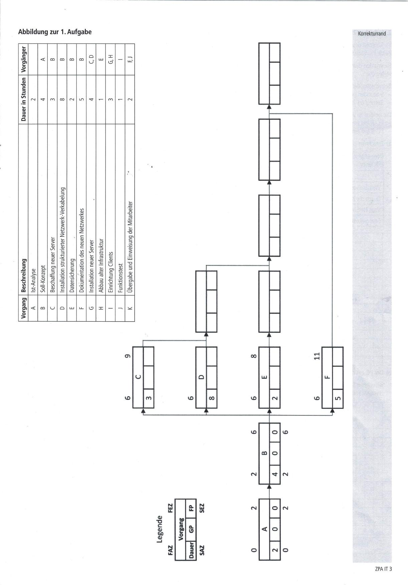
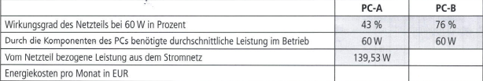

# Aufgabenbreich 1:




# Aufgabenbereich 2:
Im Rahmen des Umzugs sollen einige PCs neu angeschafft werden. Der Kunde soll sich zwischen zwei PC-Varianten entscheiden.
Beide PC-Varianten sind nahezu baugleich bis auf das verwendete Netzteil.

Sie wurden damit beauftragt, für eine Besprechung die Energieffizienz der beiden PCs unter ökonomischen Gesichtspunkten zu vergleichen.

Betriebsstunden:
- 9 Stunden pro Tag
- Betrieb an 20 Arbeitstagen pro Monat

Die  beiden zu vergleichenden PCs sind wie folgt ausgestattet:
- PC-A hat ein niedrigpreisiges Netzteil ohne Zertifikat
- PC-B hat ein Netzteil nach dem 80Plus Gold Standard

### Aufgabe 2a) - Thema Energiekosten berechnen - 6 Punkte
Errechnen Sie die Leistung und die Energiekosten pro Monat, wenn eine kWh 20 Cent kostet.

Dem englischsprachigen Manual des Netzteilskönnen Sie folgende Definitionen entnehmen:
Efficiency = Useful power output/Total power input  


### Aufgabe 2b) - Thema Amortisierungsrechnung  - 4 Punkte
Der PC mit dem Netzteil nach dem 80Plus Gold Standard kostet in der Anschaffung 100EUR mehr.

Berechnen Sie die Dauer in Monaten, ab der sich die Anschaffung amortisiert hat.
Hinweis: Falls Sie Aufgabe a) nicht lösen konnten, rechnen Sie bei PC-A mit 6,83 EUR und bei PC-B mit 4,78 EUR.

### Aufgabe 2c) - Thema Energiekosten senken - 3 Punkte
Machen Sie drei weitere Vorschläge zur Senkung der Energiekosten des IT-Arbeitsplatzes.

### Aufgabe 2d) - Thema elektrische Stromstärke berechnen - 4 Punkte
Bei der Installation der Geräte stellen Sie fest, dass folgende Geräte über eine einzige Mehrfachsteckdosemit der Aufschrift "maximal 16 A" angeschlossen werden sollen.
- 3 PCs mit einer maximalen Leistungaufnahme von jeweils 180 W
- Ein Drucker mit einer maximalen Leistungsaufnahmen von 400 W
- Eine Kaffeemaschine mit einer maximalen Leisungsaufnahme von 1.200 W
- Klimagerät mit einer maximalen Leisungsaufnahme von 2.000 W

Weisen Sie durch eine Rechnung nach, dass diese Geräte nicht gleichzeitig betrieben werden können.

### Aufgabe 2e) - Thema Speicher berechnen (Pseudocode) - 8 Punkte
Für den gewählten Rechner wird eine Datensicherung erstellt. Ihr Kollege hat das folgende Script erstellt, welches eine Warnung ausgeben soll, wenn der Speicherplatz auf dem Ziellaufwerk Z unter 15 % fällt.  
  
Leider funktioniert das Script nicht wie gewünscht und bringt eine Warnmeldung, obwohl das Laufwerk nur zu 50 % gefüllt ist.
Lesen Sie sich die folgende Anleitung (manual) durch und korrigieren Sie in der obigen Tabelle die **zwei Fehler**.

Manual: To use a comparison operator, specify the values that you want to compare together with an operator that separatesthese values. The Shell includes the following comparison operators.:

| **Operators** | **Description** |
| --- | --- |
| -eq | equals |
| -ne | not equals |
| -gt | greater than |
| -ge | greater than or equal |
| -lt | less than |
| -le | less than or equal |

Note:   
Write-Host produce a display output.  
Get-Volume return a Volume object that match the specified criteria.
----
# Aufgabenbereich 4:
Die IT.SYS Gmbh hat von der Arztpraxis Care auch noch den Auftrag erhalten, Datenschutz und Datensicherheit zu gewährleisten und gegebenenfalls Maßnahmen zu ergreifen.
Sie werden beauftragt, sich dieser Aufgabe anzunehmen.

### Aufgabe 4a) - Thema Allgemeine Grundlagen der Informationssicherheit - 6 Punkte
In einem ersten Schritt informieren Sie sich über allgemeine Grundlagen der Informationssicherheit. Als wichtige Schutzziele werden hier u. a. Vertraulichkeit, Integrität und Verfügbarkeit genannt. Sie klären nun, welches Schutzziel der jeweiligen Sicherheitsmaßnahme zugeordnet werden kann. Setzen Sie dazu pro Zeile ein Kreuz und geben Sie eine Begründung für Ihre Zuordnung an.


### Aufgabe 4b) - Thema Basis-Anforderungen zur Absicherung eines PC-Clients - 2 Punkte
Im IT-Grundschutz-Kompendium des Bundesamtes für Sicherheit in der Informationstechnik (BSI) finden Sie Basis-Anforderungen zur Absicherung eines PC-Clients.

Nennen Sie je eine Maßnahme, mit denen die folgenden Anforderungen umgesetzt werden könnten.
```txt
- Aktivieren von Autoupdate-Mechanismen:
- Differenzieren von Benutzerrollen (Rollentrennung):
```
### Aufgabe 4c) - Thema Schutzbedarfsanalyse - 6 Punkte
Im Rahmen einer Schutzbedarfsanalyse versuchen Sie zu ermitteln, wie wichtig die verwendeten unternehmensrelevanten IT-Anwendungen für den Fortgang des Geschäftsprozesses sind, um das Maß an benötigtem Schutz zu definieren.

Folgende Schutzbedarfskategorien werden vorgeschlagen:
|**Kategorie**|**Beschreibung**|
|---|---|
|Niedrig bis mittel|Die Schadensauswirkungen sind begrenzt und überschaubar.|
|Hoch|Die Schadensauswirkungen können beträchtlich sein.|
|Sehr hoch|Die Schadensauswirkungen können ein existenziell bedrohliches, katastrophales Ausmaß erreichen.|

In einer Tabelle wurde bereits der Schutzbedarf verschiedener IT-Anwendungen zugewiesen.
Fügen Sie jeweils eine mögliche Begründung für den gewählten Schutzbedarf hinzu.
|**IT-Anwendung**| | |**Schutzbedarfsfestellung**|
|---|---|---|---|
| |Schutzziel|Kategorie|Begründung|
|Prüfziffernverfahren bei der Übermittlung der Krankenversicherungsnummer|Integrität|hoch|z. B.:Verfälschte Daten bei der Übertragung können zu fehlerhaften Abrechungen führen.|
|Textverarbeitung|Verfügbarkeit|mittel||
|Software zur telemedizinischen Beratung über Videokonferenz|Vertraulichkeit|hoch||
|Patientendatenverarbeitung|Integrität|sehr hoch||

### Aufgabe 4d) - Thema Datenschutz - 2 Punkte
Die Arzthelferin an der Rezeption möchte von Ihnen wissen, für welche Art von Daten ein besonderer Schutz gesetzlich vorgeschrieben ist.
Geben Sie der Arzthelferin Auskunft und benennen Sie hierzu eine rechtliche Grundlage.

```txt

```

### Aufgabe 4e) - Thema Passwortsicherheit - 4 Punkte
Führen Sie zwei Kriterien an, die ein sicheres Passwort erfüllen sollte. 
Beschreiben Sie auch, warum diese Kriterien für eine höhere Sicherheit sorgen.

```txt

```

### Aufgabe 4f) - Thema Festplattenpartitionen - 4 Punkte
Die Gebührenabrechnungssoftware ist so eingerichtet, dass der Datenbestand freitags beim Herunterfahren des PCs auf einer speziell eingerichteten Partition der Festplatte gesichert wird.
#### 4fa)
Ihr Teamleiter beauftrag Sie, der Leiterin des Praxismanagements die Risiken aufzuzeigen.
Beschreiben Sie zwei der Risiken.

```txt

```
#### 4fb) Unterbreiten Sie der Leiterin einen konkreten Verbesserungsvorschlag.
```txt

```

----