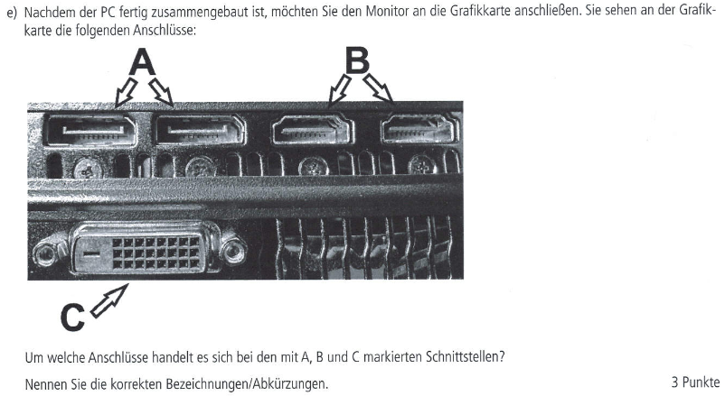
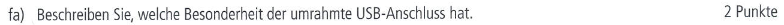
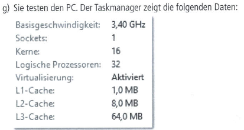
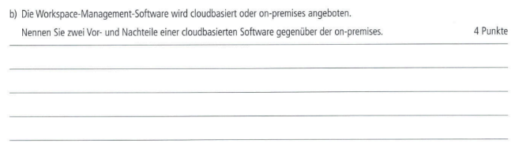

# AP1 Frühjahr 2022

## AP1 Frühjahr 2022 Aufgabe 1 - 25 Punkte

----

## Aufgabe:

### Situation
Sie absolvieren eine Ausbildung bei der AllRound AG, einem im Jahr 1985 gegründeten IT-Systemhaus mit 720 Mitarbeiterinnen
und Mitarbeitern in weltweiten Niederlassungen. Nach einer Krisensituation, einem Wechsel in der Geschäftsführung und einer Neuausrichtung hat die AllRound AG sich zum Anbieter größerer und internationaler IT-Projekte entwickelt.

Ein AuBendienstmitarbeiter hat erfahren, dass bei der Rullix GmbH eine Aktualisierung der IT-Gesamtkonzeption ansteht. Die Rullix GmbH produziert und vertreibt Bauteile im Bereich der E-Mobilität und besitzt weltweit mehrere Standorte. Da sie nicht über ausreichende Personalkapazitäten für die eigene Durchführung verfügt, soll dieses Projekt extern vergeben werden. Der AuBendienstmitarbeiter hat bereits die Möglichkeit eines Erstkontaktes hergestellt mit dem Ziel, die Rullix GmbH als Kunden zu
gewinnen.

### a) Als Vorbereitung auf das Erstgespräch mit der Rullix GmbH soll zunächst die AllRound AG allgemein und dann das Leistungsangebot vorgestellt werden, um die Eignung der AllRound AG für diesen Auftrag herauszustellen.
Sie sollen eine Präsentationsfolie für die allgemeine Unternehmensdarstellung der AllRound AG erstellen, um für den gewünschten Auftrag einen möglichst guten Eindruck zu hinterlassen. Aus der eingangs beschriebenen Situation sind dazu drei geeignete betriebliche Informationen herauszustellen, um diese auf der Folie als möglichst präsentationsgeeignete Stichpunkte anzuführen. Dabei soll jeder einzelne Stichpunkt eine Botschaft vermitteln. Die inhaltliche Vorlage fir die gestalterische Umsetzung soll in Form von Aufzählungspunkten erfolgen, wie in dem Beispiel bereits angedeutet ist.

#### aa) Vermerken Sie im Notizbereich drei inhaltliche Botschaften, welche Sie aus der obigen Situationsbeschreibung in Ihrer Präsentationsfolie zum Ausdruck bringen wollen.

#### ab) Ergänzen Sie den Folienbereich um die drei zur Botschaft passenden Aufzählungspunkte.

### b) Aus dem Unternehmensportfolio der AllRound AG sind Ihnen folgende Begriffe im Gedächtnis:
- Industrie 4.0
- Support in den Bereichen Prozess- und IT-Management
- Migrationsunterstützung
- Big Data
- Cloud-Hosting in allen Varianten
- Beratung im Hinblick auf DSGVO und BDSG
- Webhosting
- Remarketing von IT-Geraten

Die Leistungsangebote der AllRound AG sollen dem Kunden nicht nur erklärt, sondern auch sprachlich überzeugend formuliert werden.

Wählen Sie aus den obenstehenden Begriffen drei aus und beschreiben Sie diese dem zukünftigen Kunden so, dass die einzelnen Leistungsangebote möglichst auftrags- und nutzenbezogen erläutert werden.

| Leistungsangebot | Erlauternder Text, in ganzen Sätzen |
| ---- | ---- |
| Industrie 4.0 | Beispiel: Wir optimieren Ihren Produktionsprozess durch Nutzung intelligenter Informations- und Kommunikationstechnik. Angestrebt wird die Schaffung einer möglichst hohen Flexibilitat durch eine weitgehend selbstorganisierte Produktion. |
| Begriff |  |
| Begriff |  |
| Begriff |  |

### c) Die AllRound AG soll ein Angebot für das Projekt zur kompletten Neuorganisation der Verwaltung und der T-Gesamtkonzeption der Rullix GmbH erstellen.

#### ca) Schildern Sie analog des Beispiels, warum folgende Informationen für die Erstellung des Angebots benötigt werden:

| Information | Erläuterungen |
|----|----|
| Beispiel: Räumliche Gegebenheiten | Beispiel: Bestimmung der Entfernungen, um den logistischen Aufwand abschätzen zu können |
| Lastenheft |  |
| Geplanter Zeitrahmen |  |
| Ergebnisse der Ist-Analyse |  |

#### cb) Zur Erstellung eines Angebots werden auch formale Informationen benötigt, z. B. die Adresse. Welche formale Information könnte darüber hinaus auch noch erforderlich sein?

----

## Test Aufgabe:

- Hier kommt die selbsterstellte Testaufgabe rein.

----

----

# AP1 Fruehjahr 2022 Aufgabe 2
##
----

----

## Aufgabe 2 - Thema Hardwarekomponenten - 24 Punkte:

### Aufgabe 2a) - CPU Einbau

### Aufgabe 2aa) - Drei Schritte zum Einbau - 3 Punkte

### Aufgabe 2ab) - Achtsamkeitspunkte - 2 Punkte

### Aufgabe 2b) - Wärmeleitpaste - 2 Punkte

### Aufgabe 2c) - Dual Channeling - 3 Punkte

### Aufgabe 2d) - M.2 SSD vs SATA SSD - 2 Punkte

### Aufgabe 2e) - Grafikkarten Schnittstellen - 3 Punkte

### Aufgabe 2f) - I/O Panel

### Aufgabe 2fa) - Eingerahmter USB Anschluss - 2 Punkte

### Aufgabe 2fb) - USB-C vs USB-3 - 2 Punkte

### Aufgabe 2g) - Taskmanager

### Aufgabe 2ga) - Logische Prozessoren - 2 Punkte

### Aufgabe 2gb) - Cache - 2 Punkte

### Aufgabe 2gc) - GHz zu Hertz - 1 Punkt

----

## Selbsterstellte Aufgabe:
###### Selbsterstellte Aufgabe Vrbanic
### Aufgabe Xa)
>**Xa)** Sie möchten ihr veraltetes Mainboard gegen ein neueres austauschen und bestellen sich somit ein hochwertiges aus dem Internet.

### Aufgabe Xaa)
>**Xaa)** Beschreiben sie, auf welche zwei Punkte bei dem Kauf eines neuen Mainboards geachtet werden soll.

### Aufgabe Xab)
>Nach dem öffnen des Pakets fällt ihnen auf das zu ihrem Mainboard ebenfalls ein Päckchen mit Abstandshaltern geliefert worden ist.
>
>**Xab)** Erläutern sie, welche Aufgabe die Abstandshalter haben.

### Aufgabe Xb)
>**Xb)** Sie haben sich dazu entschieden ihre Stromversorgung aufzustocken. Diese kommt versehen mit einem "80 Plus Gold" Sticker.

### Aufgabe Xba)
>**Xba)** Erläutern sie, welche Bedeutung dieser Sticker beinhaltet.

### Aufgabe Xbb)
>In der Produktbeschreibung wurde groß ausgeschrieben das es sich hierbei um ein Modullares Netzteil handelt.
>
>**Xbb)** Was ist der Unterschied zwischen einem Moddularen und einem nicht Moddularen Netzteil.

### Aufgabe Xc)
>Zur Erweiterung der Speicherkapazität wurden die Begriffe HDD und SSD genutzt.
>
>**Xc)** Für was stehen diese Abkürzungen und was ist ein Vorteil und Nachteil einer SSD?

### Aufgabe Xd)

>**Xd)** Um welche Schnittstellen handelt es sich?

### Aufgabe Xe)
>**Xe)** Sie legen sich einen neuen Prozessor passend zu ihrem neuen Mainboard zu, jedoch wirft das Spezifikationenblatt Fragen auf.

### Aufgabe Xea)
>**Xea)** Um welche Kerne handelt es sich bei einem Prozessor?

### Aufgabe Xeb)
>**Xeb)** Was ist Übertakten und welche Risiken birgt es?

### Aufgabe Xec)
>**Xec)** Was sind die bekanntesten Arten von CPU-Kühlern und wie funktionieren sie?

----

----

#
## AP1 Fruehjahr 2022 Aufgabe Nr 3

----

## Aufgabe:

  
  
  

----

## Test Aufgabe:

  

[PDF Link](https://studentcloud.bbw-suedhessen.de/index.php/apps/files?dir=/FIAE2023-shared/100_Ausbildung/100_Pr%C3%BCfungsvorbereitung/AP1/Musterl%C3%B6sungen/Fruehjahr_2022_Nr3_Meyer&openfile=2430476)

----

----

# 
## AP1 Frühjahr 2022 Aufgabe Nr 4

----

## Aufgaben:
  
  
  
  
  
  

----

## Test Aufgaben:

#### Test Aufgabe zu 4 a): 
Erläutern Sie anhand des oben zitierten Textes, welche Vorteile die Nutzung einer Workspace-Management-Software für die IT-Abteilung eines Unternehmens bietet.
Hinweis: Gehen Sie dabei auf Aspekte wie Effizienz, Zeitersparnis, Sicherheit und Lizenzmanagement ein.

#### Test Aufgabe zu 4 b): 
Erörtern Sie, wie die Entscheidung zwischen einer cloudbasierten und einer on-premises Workspace-Management-Software von den individuellen Anforderungen und der IT-Infrastruktur eines Unternehmens abhängt. Nennen Sie dabei mindestens drei Entscheidungsfaktoren.

#### Test Aufgabe zu 4 c):

Gegeben: 
Fremdbezug = 30,00 EUR pro Jahr pro Lizenz  
Eigenentwicklung = Personalaufwand von 14.000 Stunden  
Jährliche Wartung = 160 Stunden pro Jahr  
Mitarbeiter stundengehalt = 90 EUR 

#### Test Aufgabe zu 4 e):
Gegeben:  
Dateigröße = 200MiByte  
Download = 100Mbit/s   
Upload = 60 Mbit/s
