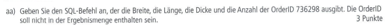
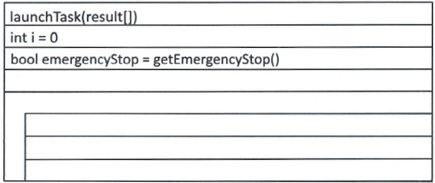
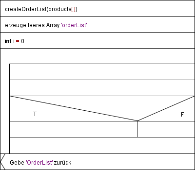

# AP1 Herbst 2022

#
## AP1 Herbst 2022 Aufgabe Nr 1

----

## Aufgabe:

# Situation

Ihr Ausbildungsbetrieb, die Package AG, produziert und handelt mit Verpackungsmaterial. Um dem Marktpotenzial aufgrund der enorm gestiegenen Nachfrage gerecht zu werden, hat die Geschäftsleitung Investitionen zur Steigerung der Produktionskapazitäten beschlossen. Dies soll vor allem durch eine Erhöhung des Automatisierungsgrads erreicht werden, die weitreichende Auswirkungen auf die künftige Gestaltung und Ausstattung der Arbeitsplätze in der Produktion haben wird. Für diese Aufgabe wurde daher eine eigene Arbeitsgruppe gebildet.  
Sie wurden in diese Arbeitsgruppe aufgenommen.

## 1. Aufgabe

### a)  
Die Marktsituation der Package AG ist aktuell noch gekennzeichnet durch wenige Anbieter, aber viele Nachfrager.  

- **aa)** Nennen Sie die aktuell vorliegende Marktform.  
- **ab)** Es ist jedoch festzustellen, dass immer mehr Anbieter auf den Markt drängen.  
  Nennen Sie die neue Marktform, mit der die Package AG zukünftig rechnen sollte.

### b)  
Um bei dem komplexen Vorhaben den Überblick zu behalten, legt die Arbeitsgruppe Projektschritte (z. B. Projektinitiierung) fest.  
**Beschreiben Sie in nachvollziehbaren Stichpunkten zu jedem Projektschritt einen inhaltlichen Aspekt, der durchzuführen ist.**

| **Projektschritte, z. B.**      | **Inhaltlicher Aspekt, z. B.**               |
|----|----|
| 1. Projektinitiierung           | Identifikation eines Problembereiches        |
| 2. Beschreibung des Istzustands |                                              |
| 3. Definition des Sollkonzepts  |                                              |
| 4. Planung                      |                                              |
| 5. Umsetzung                    |                                              |
| 6. Überprüfung der Zielerreichung |                                           |
| 7. Ausblick                     |                                              |

### c)  
**„Stakeholder" beeinflussen die Machbarkeit von Projekten.**  
Beschreiben Sie drei Gruppen von Stakeholdern mit deren Einfluss auf das Projekt.  

### d)  
**In der Projektgruppe wird die Einbindung eines externen Projektberaters diskutiert.**  
Welche Vorteile und Nachteile sind damit verbunden?  
Nennen Sie insgesamt fünf Vor- und/oder Nachteile, z. B. zwei Vorteile und drei Nachteile.  

- **Vorteile:**  
  -  

- **Nachteile:**  
  -  

### e)  
**Alternativ zu internen Fachkräften kann aus dem Büro des Projektberaters vergleichbares Personal zu einem effektiven Stundensatz von 85 EUR beauftragt werden.**  
Berechnen Sie den effektiven Stundensatz der internen Fachkräfte mit nachfolgenden Angaben:  
- 260 Arbeitstage pro Jahr,  
- 7,8 Std. pro Tag,  
- 30 Urlaubstage pro Jahr,  
- 5 Krankheitstage pro Jahr,  
- 5 Feiertage pro Jahr,  
- Jahreskosten eines Arbeitnehmers 140.000 EUR  

### f)  
Es stellt sich die Frage, ob mit dem Projektberater ein Dienstvertrag oder Werkvertrag abgeschlossen werden soll.  
**Geben Sie eine begründete Empfehlung.**

## Test Aufgabe Rücker:

## Test Aufgabe Hübscher:

# Situation  

Die TechSys GmbH ist ein mittelständisches Unternehmen, das sich auf die Entwicklung und den Vertrieb von Softwarelösungen für die Automobilindustrie spezialisiert hat. Aufgrund steigender Anforderungen an die Softwarequalität und Effizienz hat die Geschäftsleitung beschlossen, ein neues Qualitätsmanagementsystem (QMS) einzuführen. Dieses System soll sowohl die internen Prozesse optimieren als auch die Einhaltung internationaler Standards wie ISO 9001 sicherstellen. Sie wurden als Mitglied einer Projektgruppe zur Einführung des QMS ausgewählt.  

## 1. Aufgabe  

### a)  
Der Markt für Softwarelösungen in der Automobilindustrie ist aktuell durch eine Vielzahl an Anbietern und Nachfragern geprägt.  

- **aa)** Nennen Sie die aktuell vorliegende Marktform.  
- **ab)** Angenommen, durch Fusionen und Übernahmen reduzieren sich die Anbieter deutlich.  
  Nennen Sie die neue Marktform, die in diesem Szenario entstehen könnte.  

### b)  
Um den Einführungserfolg des Qualitätsmanagementsystems sicherzustellen, definiert die Projektgruppe Schritte zur Umsetzung.  
**Beschreiben Sie in nachvollziehbaren Stichpunkten zu jedem Projektschritt einen inhaltlichen Aspekt, der durchzuführen ist.**

| **Projektschritte, z. B.**      | **Inhaltlicher Aspekt, z. B.**               |
|----|----|
| 1. Projektinitiierung           | Analyse der bestehenden Qualitätsanforderungen |
| 2. Beschreibung des Istzustands |                                              |
| 3. Definition des Sollkonzepts  |                                              |
| 4. Planung                      |                                              |
| 5. Umsetzung                    |                                              |
| 6. Überprüfung der Zielerreichung |                                           |
| 7. Ausblick                     |                                              |

### c)  
**„Stakeholder" beeinflussen die Machbarkeit von Projekten.**  
Beschreiben Sie drei Gruppen von Stakeholdern mit deren Einfluss auf das Projekt.  

### d)  
**In der Projektgruppe wird die Einbindung eines externen Qualitätsberaters diskutiert.**  
Welche Vorteile und Nachteile sind damit verbunden?  
Nennen Sie insgesamt fünf Vor- und/oder Nachteile, z. B. zwei Vorteile und drei Nachteile.  

- **Vorteile:**  
  -  

- **Nachteile:**  
  -  

### e)  
**Alternativ zu internen Fachkräften kann aus dem Büro des Qualitätsberaters vergleichbares Personal zu einem effektiven Stundensatz von 100 EUR beauftragt werden.**  
Berechnen Sie den effektiven Stundensatz der internen Fachkräfte mit nachfolgenden Angaben:  
- 250 Arbeitstage pro Jahr,  
- 8 Std. pro Tag,  
- 28 Urlaubstage pro Jahr,  
- 6 Krankheitstage pro Jahr,  
- 9 Feiertage pro Jahr,  
- Jahreskosten eines Arbeitnehmers 120.000 EUR  

### f)  
Es stellt sich die Frage, ob mit dem Qualitätsberater ein Dienstvertrag oder Werkvertrag abgeschlossen werden soll.  
**Geben Sie eine begründete Empfehlung.**  

----

----

## AP1 Herbst 2022 Aufgabe 2 - 25 Punkte

----

## Aufgabe:
Die Package AG plant die Anschaffung einer kleinen Fertigungslinie für Karton, welche mit einer Arbeitsbreite von **508 mm** und eine Produktionsgeschwindigkeit von **30,48 m/min** Karton auf Rollen produziert. Die Anlage soll **zwölf Stunden pro Tag** produktiv sein.

Karton wird zum Teil aus Altpapier hergestellt, Unreinheiten wirken sich auf die Qualität des Kartons aus. Zur Qualitätssicherung wird die erzeugte Kartonbahn fortlaufend durch eine Kamera gescannt. Die entstandenen Bilder werden ausgewertet und anschließend gespeichert. Bei erkannten Verfärbungen der Oberfläche oder Einschlüssen im Karon werden die aktuellen Rollen als mindere Qualität eingestuft.

Erfasste Scanfläche:    **50,80 cm** breit x **30,48 cm** lang
Auflösung:  400 dip x 400 dpi
Farbtiefe:  16 Bit
1 Inch: 2,54 cm

### Aufgabe 2 a) - 2 Punkte
Ermitteln Sie zunächst die Zahl der Scans/Aufnahmen pro Tag. Der Rechenweg ist anzugeben.

### Aufgabe 2 b)
Die Daten der Scans werden einen Tag für Auswertung und Qualitätskontrolle gespeichert.

#### Aufgabe 2 ba) - 4 Punkte
Ermitteln Sie das zu speichernde Datenvolumen in MiB pro Scan. Der Rechenweg ist anzugeben

#### Aufgabe 2 bb) - 2 Punkte
Ermitteln Sie anschließend das gesamte zu speichernde Datenvolumenpro Tag in TiB.
Runden Sie das Ergebnis auf volle TiB auf.
Der Rechenweg ist anzugeben.

Hinweis: Sollten Sie Aufgabe a) oder Teilaugabe ba) nicht gelößt haben, gehen Sie von **100.000 Scans/Aufnahmen** pro Tag und **70 MiB** Datenvolumen pro Scan aus.

### Aufgabe 2 c)
In Abstimmung mit der IT-Abteilung beschließen Sie, ein redundantes Speichersystem einzurichten. Dazu sind folgende Komponennten verfügbar:
- 2 Festplatten (je 3 TB Speicherkapazität)
- 7 Festplatten (je 2 TB Speicherkapazität)
- PCI RAID-Hostadapter

#### Aufgabe 2 ca) - 4 Punkte
Mit allen vorhandenen Festplatten soll eine fehlertolerante RAID 5-Konfiguration erstellt werden, welche die größtmögliche Nettospeicherkapazität biete.

Berechnen Sie die maximale Nettospeichekapazität in TB. Der Rechenweg ist anzugeben.
___
RAID-Level:
___
Netto-Speicherkapazität:
___

#### Aufgabe 2 cb) - 2 Punkte
Für einen Vergleich soll auch die Speicherkapazität berechnet werden, wenn man die gegbenen Festplatten als JBOD (Zusammenvassung aller Festplatten zu einem logischen Volumen) nutzt.

Ermitteln Sie die erreichbare Speicherkapazität in TB. Der Rechenweg ist anzugeben.
___
Speicherkapazität in TiB:   *Ich glaube das TiB ist ein Schreibfehler, weil in der Aufgabenstellung TB steht.*
___

#### Aufgabe 2 cc) - 4 Punkte
Beschreiben Sie zwei Vorteile, die ein Laufwerksverbund als JBOD gegenüber einem RAID 0 bietet. 

### Aufgabe 2 d) - 3 Punkte
Die im Netzwerk der Hauptverwaltung eingesetzten NAS-Speichersysteme sollen durch ein SAN (Strorage Area Network) abgelöst werden.

Nennen Sie drei Vorteile, die den Einsatz begründen.

### Aufgabe 2 e) - 4 Punkte
Für die Kennzeichnung der produzierten Kartonrollen durch einen maschienenlesbaren Aufkleber schlägt die Geschäftsleitung die Verwendung von Barcode, QR-Code oder RFID-Chips vor.

Stellen Sie jeweils einen Vor- und Nachteil der Kennzeichnung mit QR-Code bzw. RFID-Chips in der folgenden Tabelle gegenüber.

----

## Test Aufgabe:

a)    
Gegeben sind die folgenden Daten:  
Festplatte: 250 GiB  
Auflösung: 1920 x 1080  
Farbtiefe: 3 Byte  
Wie viele Bilder können auf der Festplatte gespeichert werden?  
Gib das Ergebnis in ganzen Bilder an.  
___
Gegeben sind:  
- 2 Festplatten (je 3 TB Speicherkapazität)  
- 7 Festplatten (je 2 TB Speicherkapazität)  
Berechnen Sie die Nettospeicherkapazität bei RAID 6 
___
c)  
Beschreiben sie den Unterschied zwischen JBOD und RAID 0.  
___
d)  
Was sind drei Vorteile die NAS gegenüber SAN hat?  
___
e)  
Welche Vorteile haben RFID-Chips beim Tracken von Produkten in der Logistik um höhren Aufwand und Kosten zu rechtfertigen.  
Nennen Sie drei Vorteile die RFID-Chips gegenüber herkömmlichen Methoden (Barcode, QR-Code) haben.  
  
----

----

## AP1 Herbst 2022 Aufgabe 3 - 28 Punkte

----

## Aufgabe:

### a) Zur fachgerechten Kommunikation zwischen den Einzelkomponenten in der Automatisierung wird über den Einsatz von IPv6 als Ersatz für IPv4 nachgedacht.
Nennen Sie zwei technologische Vorteile der IPv6-Adressierung gegenüber IPv4, die für den Einsatz im Bereich IoT relevant sein können.

### b)  In einer abgeschlossenen Testumgebung soll die Kommunikation zwischen einigen Netzwerkkomponenten über IPv6 geprüft werden.
Dabei soll eine globale Adresse ähnlich derjenigen aus einem anderen Teilnetz des Betriebs 2001:da8:5f2d:28: : /64 verwendet werden.  
Hier handelt es sich bereits um eine verkürzte Schreibweise.  
Sie besteht aus einem 48-Bit langem Standortpräfix und einer 16-Bit Teilnetz-ID.  
Identifizieren Sie in der gegebenen Adresse die beiden genannten Komponenten und geben Sie die beiden Teile der Adresse in ihrer ungekürzten Form im hexadezimalen Format an.

### c) Geben Sie an, wie viele Teilnetze mit der gegebenen IPv6-Adresse gebildet werden können.

### d) Vergeben Sie für die abgebildete loT-Testumgebung nutzbare IPv6-Adressen auf der Grundlage der gegebenen globalen Adresse für alle Geräte. Vermischen Sie dabei aus Gründen der Übersichtlichkeit nicht die Adressen der Endgeräte mit denen der Netzwerkgeräte. Richten Sie die IP-Adressierung so ein, dass alle Geräte später auch aus einem anderen Teilnetz über den Router gewartet werden können.

### e) Auf dem loT-Gerät 1 soll nun die Erreichbarkeit des Loopback-Interfaces und des Standard-Gateways auf einer Kommandozeile geprüft werden.

### f) Nach der Eingabe des Befehls ip addr zur Anzeige der Netzwerkkonfiguration erscheint u. a. die Ausgabe fe80::62eb:69ff:fed2:d2a6/64 

### g) Die Geschäftsführung möchte im Umfeld der Maschinenautomatisierung die Mitarbeiter mit weiteren mobilen und robusten Geräten ausstatten. Der Bedarf beträgt im ersten Schritt 30 Stück.
Folgande drei unverbindliche Angebote liegen vor:

|                                                          | Noteplus AG, Mainz                  | Notebook-Clever.de, Berlin  | PC-Genie KG, Frankfurt     |
|----|----|----|----|
| **Bareinkaufspreis pro Stück**                           | 1.000 EUR                           | 1.100 EUR                   | 1.300 EUR                  |
| **Lieferbedingungen/-kosten pro Stück**                  | Ab Werk: 15 EUR                     | Frachtfrei: 10 EUR          | Frei Haus                  |
| **Bezugspreis pro Stück**                                |                                     |                             |                            |
| **Lieferzeit**                                           | 5 Wochen                            | 3 Wochen                    | 1 Woche                    |
| **Qualität**                                             | Gut                                 | Durchschnitt                | Sehr Gut                   |
| **Kundenrückmeldungen auf der Homepage der Lieferanten** | Öfter bei Lieferungen kleine Mängel | Lieferung ohne Beanstandung | Sehr gutes Kulanzverhalten |

Berechnen Sie zuerst den Bezugspreis pro Stück.  
Bewerten Sie anschließend die Anbieter und Angebote mit einer Skala von 1 (schwach) bis 3 (sehr gut).

## Test Aufgabe:

- Hier kommt die selbsterstellte Testaufgabe rein.

----

----

# AP1 Herbst 2022 Aufgabe 4
##
----

----

## Aufgabe 4 - SQL und Diagramme - 24 Punkte:
### Aufgabe 4a) - Walzanlage

### Aufgabe 4aa) - Output ohne ID - 3 Punkte

### Aufgabe 4ab) - Spezfizierte Dicke - 4 Punkte

### Aufgabe 4ac) - Produktionsanzahl - 4 Punkte

### Aufgabe 4b) - Struktogramm - 7 Punkte

### Aufgabe 4b Vorlage) - Struktogramm Vorlage

### Aufgabe 4c) - Entity-Relationship-Modell - 6 Punkte

### Aufgabe 4c Vorlage) - Entity-Relationship-Modell Vorlage

----

## Selbsterstellte Aufgabe:
###### Selbsterstellte Aufgabe Vrbanic
### Aufgabe Xa)
>**Xa)** Sie erhalten den Auftrag sich um die Lagerverwaltung einer Firma zu kümmern. Die Lagerdaten werden in einer SQL-Datenbank gespeichert. Zahlen wurden als Ganzzahlen eingetragen.
>
>Die Tabelle ProductList hat folgenden Aufbau
>
>>ProductID (PK)
>>Productname
>>Stock
>>Minimumstock
>>Supplier

### Aufgabe Xaa)
>**Xaa)** Finden sie alle Produkte, deren Lagerbestand unter dem Mindestbestand liegt.
>
> Geben sie dazu den entsprechenden SQL-Befehl an.

### Aufgabe Xab)
>**Xab)** Bestimme die Gesamtzahl an Produkten des Lieferanten "Firefly".
>
> Geben sie dazu den entsprechenden SQL-Befehl an.

### Aufgabe Xac)
>**Xac)** Bereche den durchschnittlichen Lagerbestand aller Produkte.
>
> Geben sie dazu den entsprechenden SQL-Befehl an.

### Aufgabe Xad)
>**Xad)** Der Mindestbestand für alle Produkte wird um 5 erhöht.
>
> Geben sie dazu den entsprechenden SQL-Befehl an.

### Aufgabe Xae)
>**Xae)** Es wurde das Produkt mit der ID '42' aus dem Sortiment genommen und nun muss die Datenbank angepasst werden.
>
> Geben sie dazu den entsprechenden SQL-Befehl an.

### Aufgabe Xb)
>**Xb)** Erstellen sie ein Struktogramm für die Erfassung einer Produktliste die besagt welche Produkte unter ihrem Mindestwert sind. Die Firma besitzt zurzeit 26 verschiedene Produkte.
>
> Erstellen sie die Funktion createOrderList(products[])
>
> **fetchMinStock(int)** - Übergeben wird ein Produkt. Gibt den Minimumswert eines Produkts wieder.
> 
> **fetchStock(int)** - Übergeben wird ein Produkt. Gibt den momentanen Inventarstand wieder.
>
> Ergänzen sie das gegebene Struktogramm durch die entsprechenden Befehle um eine Liste zum Bestellen von Produkten zu erstellen.

