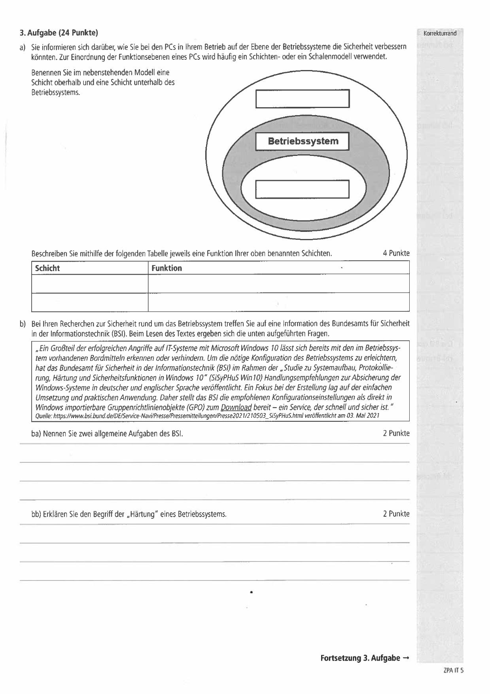
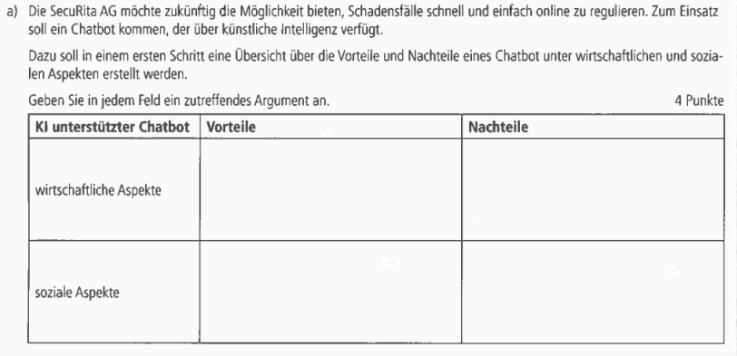
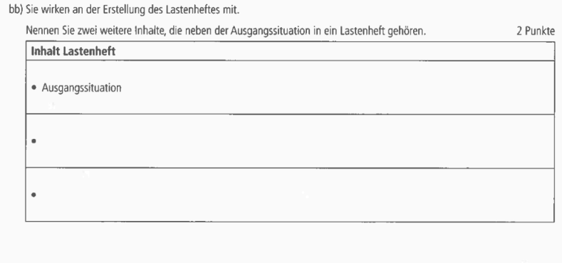
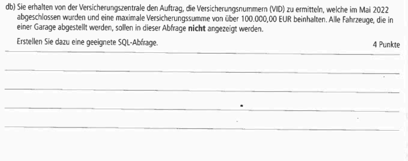

# AP1 Frühjahr 2023

----
id: ap1f_2023_a1
title: AP1 Frühling 2023 Aufgabe 1
description: My document description
----

----

## AP1 Frühjahr 2023 Aufgabe 2 Lösung 

----

## Aufgabe:


----

## aa) Ermitteln Sie den Bezugspreis der einzelnen Anbieter pro Notebook durch Ergänzung der leeren Felder in der folgenden Tabelle.

### ab) Es wurde ein Lieferant mit einem höheren Bezugspreis gewählt.
Nennen Sie drei mögliche Gründe.
```txt

```

# Quelle: Lernfeld 2: Angebotsvergleich 

## b) Sie erhalten ein weiteres Angebot. Die Best-IT-Service GmbH biete die 3.500 Notebooks zu einem Gesamtpreis von 300.000 EUR an, alternativ einen Leasingvertrag über fünf Jahre mit einer monatlichen Leasingrate von 6.000 EUR mit Kaufoption.
----

## ba) Beschreiben Sie das Grundprinzip von Leasing und erklären Sie dabei die Eigentums- und Besitzverhältnisse.

```txt

```
----

## bb) Vergleichen Sie den Kaufpreis mit den Gesamtkosten des Leasings.
Ermitteln Sie den Differenzbetrag

```txt

```
----

## bc) Nennen Sie drei Vorteile, die für einen Leasingvertrag sprechen.

```txt

```
----

## bd) Erläutern Sie den Begriff Kaufoption.

```txt

```
Quelle: Lernfeld 2 Finanzierung und Leasing
----

## Test Aufgabe:

- Hier kommt die selbsterstellte Testaufgabe rein.

----

----

#
## AP1 Frühjahr 2023 Aufgabe Nr3

----

## Aufgabe:

  
  

----

## Test Aufgabe:

  

----

----

# 
## AP1 Frühjahr 2023 Aufgabe Nr 4

----

## Aufgaben:
  
  
  
  
  


----

## Test Aufgabe:

#### Test Aufgabe zu 4 a) 
Bewerten Sie, welche zusätzlichen Anforderungen an die Datensicherheit und den Datenschutz gestellt werden müssen, wenn ein KI-gestützter Chatbot für die Schadensregulierung eingesetzt wird. Begründen Sie, warum diese Anforderungen besonders wichtig sind.

#### Test Aufgabe zu 4 b) 
Erläutern Sie, welche Informationen und Anforderungen in das Lastenheft aufgenommen werden sollten, um die Entwicklung des Chatbots möglichst zielgerichtet und effizient zu gestalten.
