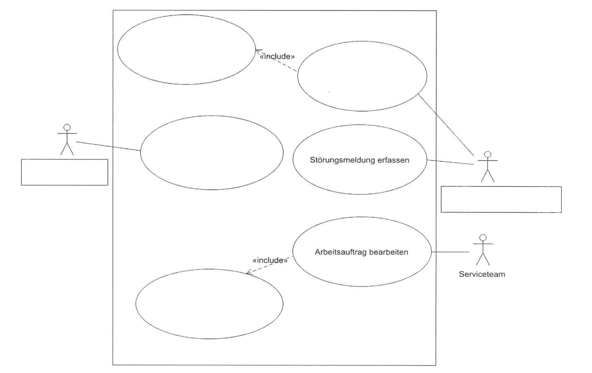

# AP1 Herbst 2023

#
## AP1 Herbst 2023 Aufgabe Nr 1

----

## Aufgabe:

# Situation

Sie absolvieren Ihre Ausbildung bei der OptiSoft-XXL GmbH. Diese hat sich als Systemhaus darauf spezialisiert, Software für Handwerksbetriebe herzustellen und anzupassen. Die Geschäftsleitung legt großen Wert auf eine umfassende Kundenbetreuung. Bisher beschränkte sich diese im Wesentlichen auf die üblichen Öffnungszeiten des Unternehmens. Zur Verbesserung der Konkurrenzfähigkeit soll ein 24/7-Service als eigene Abteilung mit passenden PC-Arbeitsplätzen eingerichtet werden.

## 1. Aufgabe

Die OptiSoft-XXL GmbH möchte ihre Servicequalität verbessern. Der bestehende Prozess zeigt Schwachstellen. Zuerst unterziehen Sie den Prozess der Störungsmeldungen einer Ist-Analyse.  
Hierzu erhalten Sie von der IT-Abteilung die folgenden Informationen:

- Kunden senden Störungsmeldungen.  
- Die Störungsmeldungen werden von der IT-Abteilung erfasst.  
- Die IT-Abteilung erstellt die Arbeitsplanung für die kommende Woche freitags. Dies beinhaltet auch immer eine Priorisierung.  
- Die Arbeitsaufträge werden vom Serviceteam bearbeitet.  
- Dies beinhaltet immer eine Rückmeldung.  

### a)  
**Ergänzen Sie das bereits angefangene UML-Anwendungsfalldiagramm (Use Case Diagram) um die fehlenden Anwendungsfälle und Bezeichnungen der Akteure.**  

### b)  
Aktuell müssen die Störungsmeldungen als E-Mail gesendet werden. Diese werden in einer Tabellenkalkulation verwaltet. Einmal in der Woche am Freitag erfolgt die Arbeitsplanung. Die Arbeitszeit des Serviceteams ist von montags bis freitags von 8:00 bis 17:00 Uhr.

#### ba)  
**Beschreiben Sie zwei Kritikpunkte an diesem Ablauf.**  
1. Lange Bearbeitungszeiten aufgrund der wöchentlichen Arbeitsplanung.  
2. Manuelle Verwaltung in Tabellenkalkulationen erhöht das Fehlerpotenzial und ist ineffizient.  

#### bb)  
**Nennen Sie zwei geeignete Maßnahmen, um die Servicequalität zu verbessern.**  
1. Einführung eines automatisierten Ticket-Systems zur Verwaltung und Priorisierung von Störungsmeldungen.  
2. Erweiterung der Arbeitszeiten des Serviceteams oder Einrichtung eines Schichtsystems für einen 24/7-Service.  

### c)  
**Sie sind sich unsicher, ob die vorgeschlagenen Maßnahmen ausreichend sind.**  
Nennen Sie drei Methoden für eine Bedarfsanalyse, um die Kundenbedürfnisse zu identifizieren.  
1. Kundenbefragungen (z. B. per Umfrage).  
2. Analyse von Kundenbeschwerden und Rückmeldungen.  
3. Benchmarking mit vergleichbaren Unternehmen.  

### d)  
Der zukünftig bessere Service wird ohne höhere Kosten nicht zu erreichen sein.  

Beantworten Sie die nachfolgenden Fragen auf Deutsch anhand des englischsprachigen Artikels.  

#### Artikel:  
> It is important to pay attention to the prices you set for your services, because they can determine the success of your business. If you price your services too high, you may be rejected by customers and fail to find sales, no matter how good they are. On the other hand, if you set your prices too low, you will not cover your costs. There is no set method for pricing services. Here are four points they should consider for service pricing.  
> - Calculate your costs.  
> - Know your customers.  
> - Look at the market.  
> - Choose a pricing model.  

#### da)  
**Benennen Sie eine Gefahr, die bei zu hohen Service-Preisen besteht.**  
- Kunden könnten die Preise ablehnen und keine Verkäufe generieren.  

#### db)  
**Benennen Sie eine Gefahr, die bei zu niedrigen Service-Preisen besteht.**  
- Die Kosten werden nicht gedeckt.  

#### dc)  
**Nennen Sie die vier im Text genannten Aspekte zur Service-Preis-Bestimmung.**  
1. Calculate your costs.  
2. Know your customers.  
3. Look at the market.  
4. Choose a pricing model.  

### e)  
Nach der vorgenommenen Preiserhöhung ruft ein Kunde an und sagt zu Ihnen:  
„Die Service-Preise sind ihr Geld nicht wert!"  

**Beurteilen Sie diese Aussage nach dem 4-Ohren-Modell.**  

1. **Sachaspekt:**  
   - Der Kunde hält die Preise für unangemessen.  

2. **Selbstaussage:**  
   - Der Kunde ist unzufrieden mit dem Preis-Leistungs-Verhältnis.  

3. **Beziehungsaspekt:**  
   - Der Kunde erwartet, dass Sie Verständnis für seine Beschwerde zeigen.  

4. **Appell:**  
   - Der Kunde fordert eine Überprüfung oder Begründung der Preise.  

## Test Aufgabe Rücker:

----

## AP1 Herbst 2023 Aufgabe 2 - 25 Punkte

----

## Aufgabe:
Zur Realisierung des 24/7-Services gilt es im Vorfeld u.a., die Rahmenbedingungen zur Telearbeit zu klären. Sie wirken hierbei mit. 

### Aufgabe 2a) - 4 Punkte
Der Teamleiter möchte zur Telearbeit PCs verwenden.

Was ist darüer hinaus noch nötig, um am Telearbeitsplatz die anfallenden betriblichen Aufgaben erledigen zu können?

Nennen und begründen Sie zwei weitere Anschaffungen oder Maßnahmen.

### Aufgabe 2b) - 4 Punkte
Ein Kollege unterbreitet den Vorschlag, Tablets zum Einsatz im Homeoffice anzuschaffen.

Erläutern Sie anhand von zwei Aspekten, warum die Anforderungen an einen Bikdschirmarbeitsplatz durch ein Tablet nicht erfüllt werden.

### Aufgabe 2c) - 4 Punkte
Als Kompromiss hat man sich auf den Einsatz von Notebooks geeinigt.
Beschreiben Sie zwei Möglichkeiten bzw. Ergänzungen, die Arbeit mit Notebooks ergonomischer zu gestalten.

### Aufgabe 2d) - 4 Punkte
Als Vorbereitung für das anstehende Gespräch mit dem Betribsrat sollen Sie Vor- und Nachteile von Homeoffice für die Beschäftigten zusammentragen.

Tragen Sie in der nachfolgenden Tabelle jeweils zwei mögliche Vorteile und zwei Nachteile ein.

### Aufgabe 2e) - 5 Punkte
Im Rahmen des 24/7-Services will die OptiSoft-XXL GmbH ihre Hotline zur angebotenen Software um die Zeit zwischen 20:00 Uhr und 06:00 Uhr erweitern. Für diese Zeit ist für den First-, Second- und Third-Level-Supportdie häusliche Erreichbarkeit als Bereitschaftszeit jeweils ein Mitarbeiter erforderlich.

Jeder Anruf wird zunächst vom First-Level-Support entgegengenommen und dann gegebenfalls weitergeleitet. Auch wenn dies der Fall ist, soll dieser zusätzliche Service dem Kunden als einheitlicher Minutenpreis angeboten werden. Weitere mögliche kosten und Nachbearbeitungszeiten zu den Anrufen sollen nicht berücksichtigt werden.

Berechnen Sie, zu welchem einheitlichen Minutensatz kalkuliert werden muss, um die Kosten der Tabelle exakt zu decken. Der Rechenweg muss nachvollziehbar sein. Runden Sie gegebenfalls auf den nächsten Cent auf.

### Aufgabe 2f) - 4 Punkte
Die Kostenpflichtigkeit der Hotline muss dem Kunden kommuniziert werden.
Formulisieren Sie (in genzen Sätzen) zwei überzeugende Argumente, die als Text für eine Email verwendet werden können.

----

## Test Aufgabe:

a)
Nennen Sie drei Sicherheitsaspekte die bei einem Telearbeitsplatz beachtet werden müssen.

b)
Nennen Sie drei Punkte die zu einem ergonomischen Bildschirmarbeitsplatz beitragen.

----

----

----
id: ap1h_2023_a3
title: AP1 Herbst 2023 Aufgabe 3
description: My document description
----

----

## AP1 Herbst 2023 Aufgabe 4 

----

## Aufgabe 4: Zur Verwaltung von Serviceanfragen soll ein neues Ticketsystem eingeführt werden.

----

## a)	Ihre Aufgabe in der Planungsabteilung ist es, den Ablauf des Projektes zu überwachen.

### aa) Nennen Sie Jeweils zwei wesentliche Merkmale von Gantt-Diagramm und Netzplan.

### ab) Bringen Sie die folgenden Vorgänge einer Planungsliste in die richtige Reihenfolge:
1-Test und Validation
2-Entwurf der Verteilung im Netz
3-Logischer Entwurf
4-Konzeptioneller Entwurf
5-Anwendung und Wartung
5-Physischer Entwurf/Implementierung
----

## b) Für eine Projektplannung erhalten Sie die folgenden Informationen in einem Gantt-Diagramm vorgelegt:

Ein Projekt beginnt mit dem Vorgang A. Nachdem dieser Vorgang nach drei Tagen abgeschlossen ist, folgen drei parallele Vorgänge: B hat sechs Tage, D dauert acht Tage, E hat fünf Tage Dauer. B hat den Nachfolger C mit vier Tagen, an den sich der Vorgang F mit drei Tagen anschließt. C und D haben zusammen mit E den gemeinsamen Nachfolger F mit drei Tagen, Auf F folgt noch der Vorgang G mit zwei Tagen.

Danach ist das Projekt beendet.

### ba) Erstellen Sie mit Hilfe der Vorgänge ein Gantt-Diagramm und zeichnen Sie die 	Abhängigkeiten ein. 

----

## bb) Ermitteln Sie, nach wie vielen Tagen das Projekt frühestens beendet werden kann.

----

## bc) ) Ermitteln Sie, welcher Vorgang der größten Puffer in Tagen hat.

----

## c)	Die zugehörige Datenbank soll nun erstellt werden. Teile des Datenbnakentwurfs wurden bereits in einem Entity-Relationship-Diagramm (EDR) umgesetzt.

Die Bearbeitung eines Tickets erfolgt in der Regel in einer oder mehreren zum Ticket gehörenden Tätigkeiten, welche durch Mitarbeiter der Serviceabteilung durchgeführt werden. Dieser Umstand soll nun zusätzlich in dem Ticketsystem abgebildet werden.

Zu jeder Tätigkeit soll eine ausführliche Beschreibung der durchgeführten Arbeiten und ein Ergebnis der Aktion gespeichert werden. Start und Ende Tätigkeiten sollen festgehalten werden.

### ca) Ergänzen Sie das ERD um die fehlenden Elemente zur Abbildung der Tätigkeiten in der Datenbank.

### cb) Sie erhalten von der Geschäftsleitung den Auftrag, aus statistischen Gründen die Anzahl der Tickets pro Priorität zu ermiteln.
### Die Ausgabe soll die Priorität und die dazugehörige Anzahl erhalten.
Erstellen Sie dazu di geeignete SQL-Abfrage:

### cc) Dem Unternehemen ist bekannt, wie viele Kunden es insgesamt hat. Nun möchte die Geschäftsleitung den Prozentsatz der Kunden ausrechnen, die Tickets haben.
### Dazu muss die Anzahl der Kunden mit einem Ticket in der Ticketdatenbank bestimmt werden.
Erstellen Sie dazu eine geeignete SQL-Abfrage.

### cd) Sie erhalten vor der Geschäftsleitung den Auftrag zu ermitteln, welche offene Tickets (Zustand=offen) einen Erfassungsmonat haben, der mehr als zwei Monate zurückliegt.
### Analysieren Sie die vorliegende Abfrage und beschreiben Sie das zu erwartende Ergebnis.
### SELECT Problembeschreibung, Prioritaet, Zustand, ErfassungDatum FROM Ticket WHERE Month (NOW()) -Month(ErfassungDatum) > 2 AND Zustand="offen" ORDER BY ErfassungDatum ASC;

----

Quelle: Lernfeld 2 Finanzierung und Leasing
----

## Test Aufgabe:

- Hier kommt die selbsterstellte Testaufgabe rein.
