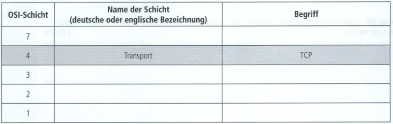
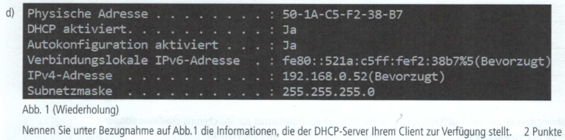
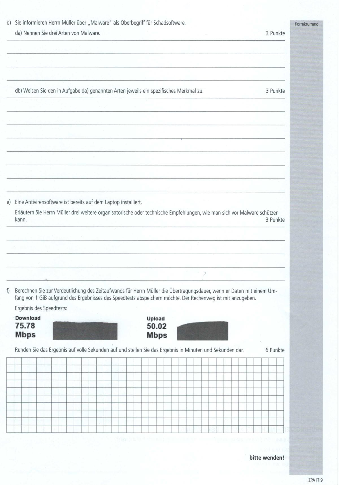
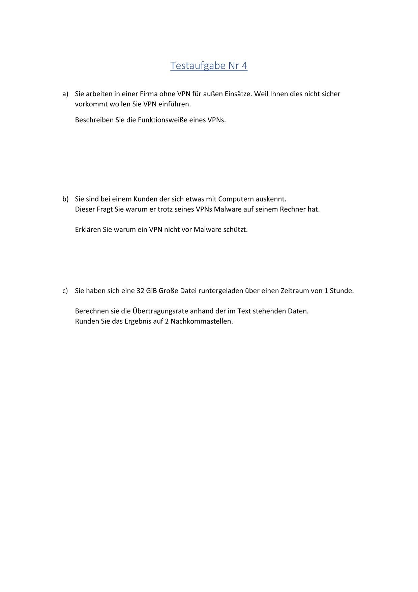

# AP1 Frühjahr 2024

## AP1 Frühling 2024 Aufgabe 1 - 26 Punkte

----

## Aufgabe:
Im Unternehmen KustoFlex Gmbh werden fünf CAD-Arbeitsplätze gerichtet.

Sind sind in dem Projektteam, das geeignete Systeme auswählt.

### Aufgabe 1a) - Thema Nutzwertanalyse - 6 Punkte
Nach der Auswertung von vier Firmenangeboten ergibt sich die folgende Tabelle. Unternehmen 3 bietet ausschließlich eine Software as a Service (SaaS) Lösung an.

> aa) Ermitteln Sie die Fehlenden Werte und eine Reihenfolge der vier Unternehmen beginnend mit der höchsten Punktzahl
```txt

```
> ab) In einem Meeting wurde neu festgelegt, dass nur eine on-premise Lösung in Frage kommt.
> Wählen Sie unter Berücksichtigung des Meetings das Unternehmens aus, das den Auftrag bekommen sollte.
```txt

```
### Aufgabe 1b) - Thema Angebotsanalyse - 7 Punkte
> Das ausgewählte Unternehmen legt folgendes Angebot vor:

|Monitor|450 EUR||
|:--|--:|----|
|PC|720 EUR||
|Softwareleasing|50 EUR|pro Monat und Arbeitsplatz|
|Wartungspauschale|1200 EUR|pro Jahr für alle Geräte|
Rabatt 5 % auf PC und Monitor

> Berechnen Sie die laufenden Kosten pro Monat für die gesamten CAD-Arbeitsplätze unter der Voraussetzung, dass die Nutzungsdauer der Monitore vier Jahre und der PCs drei Jahre beträgt.
> Geben Sie den Rechenweg an.

```txt

```

### Aufgabe 1c) - Thema Anschlusstypen - 4 Punkte
Nach der Beschaffung und Lieferung sollen die Büros vor Ort eingerichtet werden.
Die gelieferten Monitore besitzen eventuell die nachtstehenden Anschlüsse.
> Ordnen Sie die Anschlüsse den Abbildungen zu:

```txt
HDMI:
USB-C:
DVI:
Displayport (DP): 
```


### Aufgabe 1d) - Thema Kaufvertrag - 2 Punkte
Die Monitore wurden am 1. September 2023 bestellt. Es gibt keine Auftragsbestätigung und sie wurden am 7. Oktober 2023 geliefert. Die Rechnung haben Sie am 9. Oktober 2023 erhalten.

> Erläutern Sie, zu welchem Zeitpunkt der Kaufvertrag zustande gekommen ist und begründen Sie Ihre Entscheidung.

```txt

```

### Aufgabe 1e) - Thema Regelungen bei einem Kaufvertrag - 3 Punkte
Nennen Sie drei mögliche Inhalte, die durch einen Kaufvertrag geregelt sind (Abgrenzung von den juristischen Bestandteilen eines Kaufvertrags, z. B.: Willenserklärungen).
```txt

```

### Aufgabe 1f) - Thema Ordnungsgemäße Abwicklung des Kaufvertrags - 2 Punkte
Die ordnungsgemäße Abwicklung des Kaufvertrages ist dem Kunden sehr wichtig.
> fa) Nennen Sie zwei Kaufvertragsstörungen.
```txt

```

> fb) Geben Sie bei Ihren genannten Kaufvertragsstörungen je eine Maßnahme an, die der Kunde ergreifen kann, um diesen Störungen zu vermeiden.

```txt

```
----

## Test Aufgabe:

- Hier kommt die selbsterstellte Testaufgabe rein.

----

----

# AP1 Herbst 2024 Aufgabe 2
##
----

###### AP1
* Netzwerkkarten
* Netzwerkaufteilung
* OSI-Modell
* IPv6 Adressen
* MAC-Adressen
* DCHP
* ARP
###### Selbsterstellte Aufgaben
* Netzwerkkabel
* IPv4 Adressen
* Ports
* Router

----

## Aufgabe 2 - Netzwerkkonfiguration - 24 Punkte:
### Aufgabe 2) - Netzwerkeinstellungen

### Aufgabe 2a) - Netzwerk LED - 4 Punkte

### Aufgabe 2b) - OSI-Modell - 4 Punkte

### Aufgabe 2b Vorlage) - OSI-Modell Vorlage

### Aufgabe 2c) - IPv6 - 5 Punkte

### Aufgabe 2d) - DHCP - 2 Punkte

### Aufgabe 2e) - Adress Resolution Protocol - 3 Punkte

### Aufgabe 2f) - Erreichbarkeit - 2 Punkte

### Aufgabe 2g) - Adressenzuweisung - 4 Punkte

### Aufgabe 2g Vorlage) - Adressenzuweisung Vorlage


----

## Selbsterstellte Aufgabe:
###### Selbsterstellte Aufgabe Vrbanic
### Aufgabe Xa)
>**Xa)** Nach einem Umzug ihrer Abteilung in ein anderes Gebäude richten sie sich ihren Arbeitsplatz neu ein. Vor Abschluss ihrer Arbeit fällt ihnen auf das sie bisher noch kein Netzwerkkabel angebunden haben und öffnen eine Umzugskiste gefüllt mit Kabelen. Diese sind mit unterschiedlichen Kennzeichnungen versehen.

### Aufgabe Xaa)
>**Xaa)** Sie finden mehrmals den Aufdruck "SF/FTP" auf einem Netzwerkkabel.
>
>Erklären sie die Bedeutung dieser Beschriftung.

### Aufgabe Xab)
>**Xab)** Ebenfalls erkennen sie das jene Kabel mit unterschiedlichen Nummern gekennzeichnet worden sind wie z.b. "CAT 5". Sie entscheiden sich für das Kabel mit der höchsten Nummer.
>
>Erläutern sie was sich hinter der Kennzeichnung und Nummerierung verbirgt.

### Aufgabe Xb)
>**Xb)** Benennen Sie die in der folgenden Tabelle aufgeführten Tabelle aufgeführten OSI-Schichten und ordnen Sie zur Strukturierung die vorliegenden Begriffe den richtigen Schichten zu:
>
>> WLAN Protokoll
>> E-Mail Programm
>> Router
>> Dateiübertragung


### Aufgabe Xc)
>**Xc)** Nach ihrer Eingabe von "ipconfig" erhalten sie auf der Kommandozeile ihres Computers folgende Informationen.


### Aufgabe Xca)
>**Xca)** Ihnen fällt auf sie besitzen eine IPv6 und eine IPv4 Adresse. Nennen sie zwei Unterschiede zwischen den Protokollen.

### Aufgabe Xcb)
>**Xcb)** Begründen sie warum sie im Besitz beider Adressen sind.

### Aufgabe Xcc)
>**Xcc)** Während ihrer Recherche über IP-Adressen fällt ihnen auf das meist eine Zahl mit einem Doppelpunkt hinter eine IPv4 Adresse gesetzt wird.
>
>Erläutern sie wofür die genannte Zahl genutzt wird.

### Aufgabe Xd)
>**Xd)** Was ist die grundlegende Aufgabe eines Routers?

----

----

----
id: ap1f_2024_a3
title: AP1 Frühling 2024 Aufgabe 3
description: My document description
----

----

#
## AP1 Fruehjahr 2024 Aufgabe Nr 4

## Aufgabe:

  
  

----

## Test Aufgabe:

  

#### Test Aufgabe zu 4 a) 
Herr Müller speichert sensible Konstruktionsdaten auf seinem Laptop, um diese beim Kunden vor Ort bearbeiten zu können. Er möchte jedoch sicherstellen, dass diese Daten auch bei einem Diebstahl oder Verlust des Laptops geschützt bleiben.

Nennen Sie drei Maßnahmen, die Herr Müller ergreifen kann, um die Sicherheit seiner Daten zu gewährleisten. Geben Sie jeweils eine mögliche Folge an, die eintreten könnte, wenn die Maßnahme nicht beachtet wird.

#### Test Aufgabe zu 4 b) 
Herr Müller nutzt VPN, um eine sichere Verbindung zum Firmenserver der KustoFlex GmbH herzustellen. Allerdings hat er bemerkt, dass die Internetgeschwindigkeit bei der Nutzung von VPN manchmal langsamer ist.

Erläutern Sie drei mögliche Gründe, warum eine VPN-Verbindung langsamer sein kann.

#### Test Aufgabe zu 4 c) 
Herr Müller möchte seine externen Festplatten regelmäßig sichern und dabei sicherstellen, dass keine Datenverluste oder Manipulationen auftreten.

Nennen Sie drei Maßnahmen, die er ergreifen kann, um die Integrität und Verfügbarkeit seiner gesicherten Daten zu gewährleisten. Begründen Sie jeweils kurz Ihre Antwort.

#### Test Aufgabe zu 4 d) 
Herr Müller hat eine verdächtige E-Mail mit einem Anhang erhalten, den er nicht erwartet hat.

Erläutern Sie drei Anzeichen, an denen er erkennen kann, dass es sich um eine potenzielle Phishing- oder Malware-E-Mail handelt. Begründen Sie jeweils kurz Ihre Antwort.

#### Test Aufgabe zu 4 e) 
Herr Müller nutzt regelmäßig USB-Sticks, um Daten zwischen seinem Laptop und anderen Geräten auszutauschen.

Erläutern Sie drei Sicherheitsmaßnahmen, die er ergreifen sollte, um zu verhindern, dass Malware über USB-Sticks auf seinen Laptop gelangt. Begründen Sie jeweils kurz Ihre Antwort.

#### Test Aufgabe zu 4 f) 
Gegeben: 
Dateigröße = 3GiB
Dowload = 300 Mbps 
Upload = 150 Mbps
