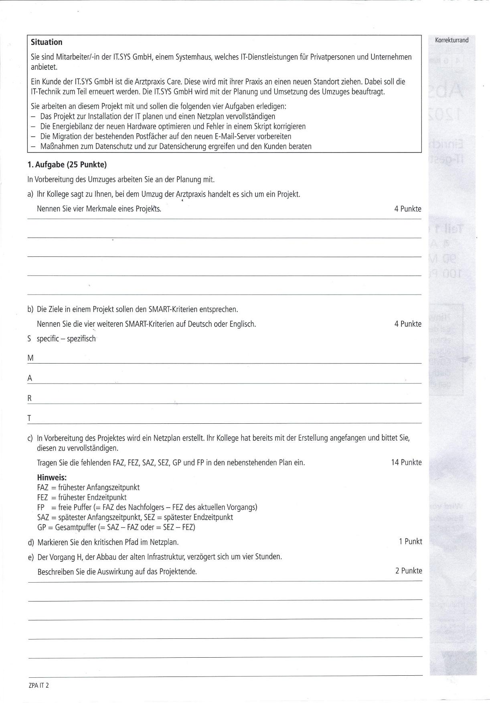
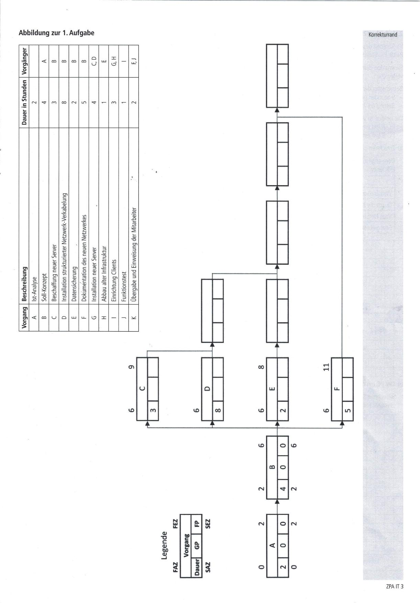
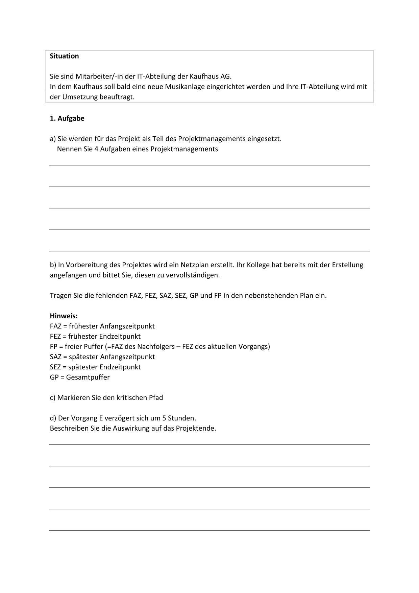
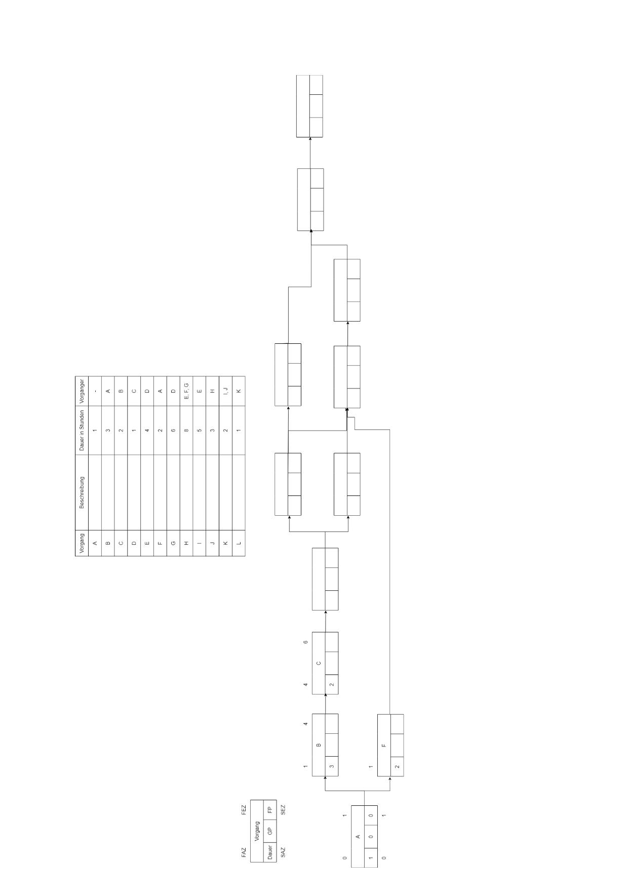

#
## AP1 Herbst 2021 Aufgabe Nr 1

## Bearbeitet von [Janis Diehl](../../../user/Auszubildende%20Holldack/diehl.md)  & [Mia Rücker](../../../user/Auszubildende%20Michel/ruecker.md)

### Themen:
- Projekt
- Projektmanagement
- Netzplan-Diagramm

---

## Aufgabe:

  

----

## Test Aufgabe:

----

## Erarbeitete Lösungen der Aufgaben

#### Lösung von [Mia Rücker](solution/ap1h_2021_a1_solution_ruecker.md)  & [Bearbeiter/in 2](solution/solution_name.md)

----

## Links zu Themen:

Zu Aufgabe 1 a):
  * Buch "IT-Berufe Grundstufe Lernfelder 1-5" S.462
  * Lernfeld 5 Arbeitsblatt "02 - In Softwareprojekten mitarbeiten"
  * https://management-methods.de/management-methoden-ueberblick/projektmanagement/definition-was-ist-ein-projekt-einfach-erklaert-nach-din-69901/#Was_ist_die_Definition_von_Projekt_nach_DIN_69901
  * TODO: Verlinkung zu weiteren Übungsaufgaben

Zu Aufgabe 1 b):
  * "IT-Berufe Grundstufe Lernfelder 1-5" S.54
  * Deutsche Quelle 1: https://www.youtube.com/watch?v=eykaYzKDVLk
  * Deutsche Quelle 2: https://www.youtube.com/watch?v=qTnPCxE8BMo
  * English Source: https://www.atlassian.com/blog/productivity/how-to-write-smart-goals

Zu Aufgabe 1 c)-e):
  * Buch "IT-Berufe Grundstufe Lernfelder 1-5" S.217-218
  * Was ist ein Netzplan? https://www.youtube.com/watch?v=zyuqZKc98sg
  * Vorwärts- und Rückwärtsrechnung im Netzplan: https://www.youtube.com/watch?v=MnE1kLW3rvs
  * Pufferzeiten und kritischer Pfad: https://www.youtube.com/watch?v=kjjN7MDwgf0

> Hier werden Seiten verlinkt mit denen man die Themen lernen kann.
