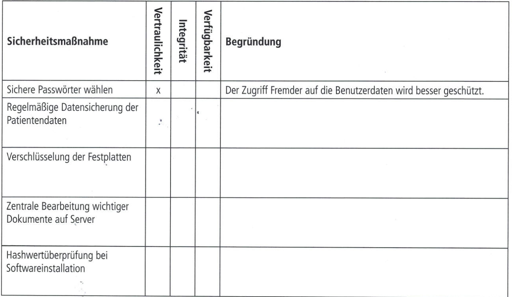

## AP1 Herbst 2021 Aufgabe 4 - 24 Punkte

## Bearbeitet von [David-Paul Adams](<../../../user/Auszubildende Holldack/adams.md>)  & [Mathaios Vardakis](<../../../user/Auszubildende Michel/vardakis.md>)

### Themen:

- Allgemeine Grundlagen der Informationssicherheit
- Basis-Anforderungen zur Absicherung eines PC-Clients
- Schutzbedarfsanalyse
- Datenschutz
- Passwortsicherheit
- Festplattenpartitionen

---

## Aufgabe:
Die IT.SYS Gmbh hat von der Arztpraxis Care auch noch den Auftrag erhalten, Datenschutz und Datensicherheit zu gewährleisten und gegebenenfalls Maßnahmen zu ergreifen.
Sie werden beauftragt, sich dieser Aufgabe anzunehmen.

### Aufgabe 4a) - Thema Allgemeine Grundlagen der Informationssicherheit - 6 Punkte
In einem ersten Schritt informieren Sie sich über allgemeine Grundlagen der Informationssicherheit. Als wichtige Schutzziele werden hier u. a. Vertraulichkeit, Integrität und Verfügbarkeit genannt. Sie klären nun, welches Schutzziel der jeweiligen Sicherheitsmaßnahme zugeordnet werden kann. Setzen Sie dazu pro Zeile ein Kreuz und geben Sie eine Begründung für Ihre Zuordnung an.


### Aufgabe 4b) - Thema Basis-Anforderungen zur Absicherung eines PC-Clients - 2 Punkte
Im IT-Grundschutz-Kompendium des Bundesamtes für Sicherheit in der Informationstechnik (BSI) finden Sie Basis-Anforderungen zur Absicherung eines PC-Clients.

Nennen Sie je eine Maßnahme, mit denen die folgenden Anforderungen umgesetzt werden könnten.
```txt
- Aktivieren von Autoupdate-Mechanismen:
- Differenzieren von Benutzerrollen (Rollentrennung):
```
### Aufgabe 4c) - Thema Schutzbedarfsanalyse - 6 Punkte
Im Rahmen einer Schutzbedarfsanalyse versuchen Sie zu ermitteln, wie wichtig die verwendeten unternehmensrelevanten IT-Anwendungen für den Fortgang des Geschäftsprozesses sind, um das Maß an benötigtem Schutz zu definieren.

Folgende Schutzbedarfskategorien werden vorgeschlagen:
|**Kategorie**|**Beschreibung**|
|---|---|
|Niedrig bis mittel|Die Schadensauswirkungen sind begrenzt und überschaubar.|
|Hoch|Die Schadensauswirkungen können beträchtlich sein.|
|Sehr hoch|Die Schadensauswirkungen können ein existenziell bedrohliches, katastrophales Ausmaß erreichen.|

In einer Tabelle wurde bereits der Schutzbedarf verschiedener IT-Anwendungen zugewiesen.
Fügen Sie jeweils eine mögliche Begründung für den gewählten Schutzbedarf hinzu.
|**IT-Anwendung**| | |**Schutzbedarfsfestellung**|
|---|---|---|---|
| |Schutzziel|Kategorie|Begründung|
|Prüfziffernverfahren bei der Übermittlung der Krankenversicherungsnummer|Integrität|hoch|z. B.:Verfälschte Daten bei der Übertragung können zu fehlerhaften Abrechungen führen.|
|Textverarbeitung|Verfügbarkeit|mittel||
|Software zur telemedizinischen Beratung über Videokonferenz|Vertraulichkeit|hoch||
|Patientendatenverarbeitung|Integrität|sehr hoch||

### Aufgabe 4d) - Thema Datenschutz - 2 Punkte
Die Arzthelferin an der Rezeption möchte von Ihnen wissen, für welche Art von Daten ein besonderer Schutz gesetzlich vorgeschrieben ist.
Geben Sie der Arzthelferin Auskunft und benennen Sie hierzu eine rechtliche Grundlage.

```txt

```

### Aufgabe 4e) - Thema Passwortsicherheit - 4 Punkte
Führen Sie zwei Kriterien an, die ein sicheres Passwort erfüllen sollte. 
Beschreiben Sie auch, warum diese Kriterien für eine höhere Sicherheit sorgen.

```txt

```

### Aufgabe 4f) - Thema Festplattenpartitionen - 4 Punkte
Die Gebührenabrechnungssoftware ist so eingerichtet, dass der Datenbestand freitags beim Herunterfahren des PCs auf einer speziell eingerichteten Partition der Festplatte gesichert wird.
#### 4fa)
Ihr Teamleiter beauftrag Sie, der Leiterin des Praxismanagements die Risiken aufzuzeigen.
Beschreiben Sie zwei der Risiken.

```txt

```
#### 4fb) Unterbreiten Sie der Leiterin einen konkreten Verbesserungsvorschlag.
```txt

```

----

## Test Aufgabe:

- Hier kommt die selbsterstellte Testaufgabe rein.

----

## Erarbeitete Lösungen der Aufgaben

#### Lösung von [Mathaios Vardakis](solution/ap1h_2021_a4_solution_Vardakis.md)  & [Bearbeiter/in 2](../AP1/2021/ap1h_2021/solution/solution_name.md)

----

## Links zu Themen:

- Hier werden Seiten verlinkt mit denen man die Themen lernen kann.
