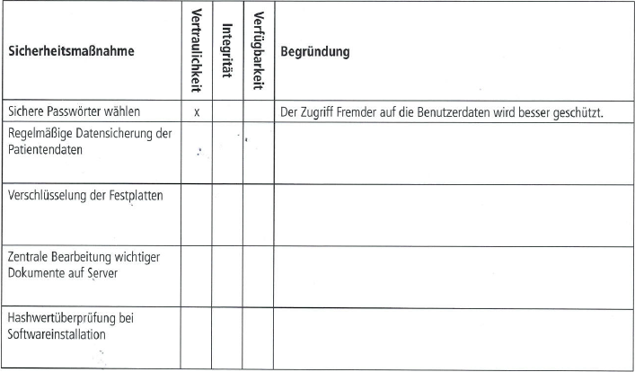

## AP1 Herbst 2021 Aufgabe 4 - 24 Punkte

## Bearbeitet von   [Mathaios Vardakis](<../../../../user/Auszubildende Michel/vardakis.md>)

### Themen:

- Allgemeine Grundlagen der Informationssicherheit
- Basis-Anforderungen zur Absicherung eines PC-Clients
- Schutzbedarfsanalyse
- Datenschutz
- Passwortsicherheit
- Festplattenpartitionen

---

## Aufgabe:
Die IT.SYS Gmbh hat von der Arztpraxis Care auch noch den Auftrag erhalten, Datenschutz und Datensicherheit zu gewährleisten und gegebenenfalls Maßnahmen zu ergreifen.
Sie werden beauftragt, sich dieser Aufgabe anzunehmen.

### Aufgabe 4a) - Thema Allgemeine Grundlagen der Informationssicherheit - 6 Punkte
In einem ersten Schritt informieren Sie sich über allgemeine Grundlagen der Informationssicherheit. Als wichtige Schutzziele werden hier u. a. Vertraulichkeit, Integrität und Verfügbarkeit genannt. Sie klären nun, welches Schutzziel der jeweiligen Sicherheitsmaßnahme zugeordnet werden kann. Setzen Sie dazu pro Zeile ein Kreuz und geben Sie eine Begründung für Ihre Zuordnung an.



````txt
Regelmäßige Datensicherung der Patientendaten => Integrität => Die Daten werden vor Verlust und Beschädigung durch die Sicherung geschützt.
Verschlüsselung der Festplatten => Vertraulichkeit => Die Verschlüsselung von Festplatten dient dazu, die auf einer Festplatte gespeicherten Daten vor unbefugtem Zugriff zu schützen.
Zentrale Bearbeitung wichtiger Dokumente auf dem Server => Verfügbarkeit => Dokumente sind von verschiedenen Standorten und Geräten aus zugänglich.
Hashwertüberprüfung bei Softwareinstallation => Integrität => Die Hashwertüberprüfung stellt sicher, dass die Softwaredatei während des Downloads oder der Installation nicht verändert wurde.
````

### Aufgabe 4b) - Thema Basis-Anforderungen zur Absicherung eines PC-Clients - 2 Punkte
Im IT-Grundschutz-Kompendium des Bundesamtes für Sicherheit in der Informationstechnik (BSI) finden Sie Basis-Anforderungen zur Absicherung eines PC-Clients.

Nennen Sie je eine Maßnahme, mit denen die folgenden Anforderungen umgesetzt werden könnten.
```txt
-Aktivieren von Autoupdate-Mechanismen: Implementierung eines zentralen Update-Management-Systems, das automatisch Software-Updates für alle relevanten Anwendungen und Betriebssysteme auf den Endgeräten im Netzwerk herunterlädt und installiert.

-Differenzieren von Benutzerrollen (Rollentrennung): Erstellen von Benutzergruppen, in denen jeder Gruppe bestimmte Rechte zugewiesen werden. Zum Beispiel könnte es eine Gruppe für Administratoren geben, die volle Zugriffsrechte hat, und eine Gruppe für normale Benutzer, die nur eingeschränkten Zugriff auf bestimmte Funktionen hat. So wird sichergestellt, dass jeder Benutzer nur das sehen und tun kann, was für seine Rolle notwendig ist.

```
### Aufgabe 4c) - Thema Schutzbedarfsanalyse - 6 Punkte
Im Rahmen einer Schutzbedarfsanalyse versuchen Sie zu ermitteln, wie wichtig die verwendeten unternehmensrelevanten IT-Anwendungen für den Fortgang des Geschäftsprozesses sind, um das Maß an benötigtem Schutz zu definieren.

Folgende Schutzbedarfskategorien werden vorgeschlagen:
|**Kategorie**|**Beschreibung**|
|---|---|
|Niedrig bis mittel|Die Schadensauswirkungen sind begrenzt und überschaubar.|
|Hoch|Die Schadensauswirkungen können beträchtlich sein.|
|Sehr hoch|Die Schadensauswirkungen können ein existenziell bedrohliches, katastrophales Ausmaß erreichen.|

In einer Tabelle wurde bereits der Schutzbedarf verschiedener IT-Anwendungen zugewiesen.
Fügen Sie jeweils eine mögliche Begründung für den gewählten Schutzbedarf hinzu.
|**IT-Anwendung**| | |**Schutzbedarfsfestellung**|
|---|---|---|---|
| |Schutzziel|Kategorie|Begründung|
|Prüfziffernverfahren bei der Übermittlung der Krankenversicherungsnummer|Integrität|hoch|z. B.:Verfälschte Daten bei der Übertragung können zu fehlerhaften Abrechungen führen.|
|Textverarbeitung|Verfügbarkeit|mittel|````Die verarbeiteten Informationen erhalten keine sensiblen oder vertraulichen Daten. ````|
|Software zur telemedizinischen Beratung über Videokonferenz|Vertraulichkeit|hoch|````Es werden sensible personenbezogene Daten genannt die unter Datenschutzrechtlinien besonders geschützt werden müssen. ````|
|Patientendatenverarbeitung|Integrität|sehr hoch|````Falsche oder manipulierte Daten können zu falschen Diagnosen und Behandlungen führen, was die Gesundheit der Patienten gefährden kann.````|

### Aufgabe 4d) - Thema Datenschutz - 2 Punkte
Die Arzthelferin an der Rezeption möchte von Ihnen wissen, für welche Art von Daten ein besonderer Schutz gesetzlich vorgeschrieben ist.
Geben Sie der Arzthelferin Auskunft und benennen Sie hierzu eine rechtliche Grundlage.
```txt
Mit sensiblen personenbezogenen Daten wie z.B Diagnose, Blutgruppe, Name, Adresse oder Telefonnummer, ist unter dem Datenschutzgesetz (Datenschutz-Grundverordnung (DSGVO) und Bundesdatenschutzgesetz (BDSG)) der Umgang mit denen exakt reguliert.
```

### Aufgabe 4e) - Thema Passwortsicherheit - 4 Punkte
Führen Sie zwei Kriterien an, die ein sicheres Passwort erfüllen sollte. 
Beschreiben Sie auch, warum diese Kriterien für eine höhere Sicherheit sorgen.

```txt
Ein sicheres Passwort sollte mindestens 12 bis 16 Zeichen lang sein und eine Kombination aus Groß- und Kleinbuchstaben, Zahlen und Sonderzeichen enthalten. Dies erhöht die Anzahl möglicher Kombinationen und macht es schwieriger, das Passwort zu erraten oder durch Brute-Force-Angriffe zu knacken.
```

### Aufgabe 4f) - Thema Festplattenpartitionen - 4 Punkte
Die Gebührenabrechnungssoftware ist so eingerichtet, dass der Datenbestand freitags beim Herunterfahren des PCs auf einer speziell eingerichteten Partition der Festplatte gesichert wird.
#### 4fa)
Ihr Teamleiter beauftrag Sie, der Leiterin des Praxismanagements die Risiken aufzuzeigen.
Beschreiben Sie zwei der Risiken.
```txt
•	Wenn der PC während des Herunterfahrens oder der Sicherung abstürzt, können Daten verloren gehen oder die Sicherung unvollständig sein. Dies könnte zu Inkonsistenzen im Datenbestand führen.
•	Wenn die Sicherung nur einmal pro Woche (freitags) erfolgt, besteht das Risiko, dass zwischen den Sicherungen wichtige Daten verloren gehen, insbesondere wenn Fehler oder Probleme an anderen Tagen auftreten.
```
#### 4fb)
Unterbreiten Sie der Leiterin einen konkreten Verbesserungsvorschlag.
```txt
Mein Vorschlag wäre die Daten mit einer Raid5 Speicher-Lösung täglich zu sichern, sodass genügend Backups entstehen und die Zeit zwischen Sicherungen kürzer wird.
```

----

## Test Aufgabe:

## Aufgabe 1 - Thema Passwortsicherheit
Nennen Sie zwei Kriterien für ein sicheres Passwort und erläutern Sie deren Bedeutung

````text

````
----

## Aufgabe 2 - Thema Schutzbedarfskategorien 
Fügen Sie für die folgenden IT-Anwendungen eine Begründung für den gewählten Schutzbedarf hinzu.

| **IT-Anwendung**                               | **Schutzziel**     | **Kategorie** | **Begründung**                                                                                     |
|------------------------------------------------|---------------------|---------------|----------------------------------------------------------------------------------------------------|
| E-Mail-Kommunikation mit Patienten             | Vertraulichkeit     | hoch          |````   ````|
| Kalenderverwaltung für Arzttermine              | Verfügbarkeit        | mittel        |````   ````|
| Datenbank für medizinische Forschung            | Integrität          | sehr hoch     |````   ````|
| Abrechnung von Patientenleistunge                | Vertraulichkeit     | hoch          |````   ````|

----

## Aufgabe 3 - Thema Datensicherung
Nennen Sie zwei Risiken, die mit der Datensicherung auf externen Speichermedien verbunden sind.
````text

````

## Links zu Themen:

- Hier werden Seiten verlinkt mit denen man die Themen lernen kann.
