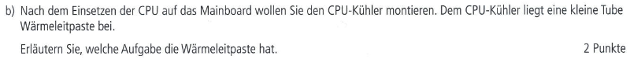

# AP1 Fruehjahr 2022 Aufgabe 2
#### Bearbeitet von [Gottschalk](<../../../user/Auszubildende Holldack/gottschalk.md>) & [Vrbanic](<../../../user/Auszubildende Michel/vrbanic.md>)

----

### Themen:
* Prozessoren
* Thermalpaste
* RAM Dual Channeling
* M.2 und SATA Festplatten
* Grafikschnittstellen
* USB-C und USB-3

----

## Aufgabe 2 - Thema Hardwarekomponenten - 24 Punkte:

### Aufgabe 2a) - CPU Einbau

### Aufgabe 2aa) - Drei Schritte zum Einbau - 3 Punkte

### Aufgabe 2ab) - Achtsamkeitspunkte - 2 Punkte

### Aufgabe 2b) - Wärmeleitpaste - 2 Punkte

### Aufgabe 2c) - Dual Channeling - 3 Punkte

### Aufgabe 2d) - M.2 SSD vs SATA SSD - 2 Punkte

### Aufgabe 2e) - Grafikkarten Schnittstellen - 3 Punkte

### Aufgabe 2f) - I/O Panel

### Aufgabe 2fa) - Eingerahmter USB Anschluss - 2 Punkte

### Aufgabe 2fb) - USB-C vs USB-3 - 2 Punkte

### Aufgabe 2g) - Taskmanager

### Aufgabe 2ga) - Logische Prozessoren - 2 Punkte

### Aufgabe 2gb) - Cache - 2 Punkte

### Aufgabe 2gc) - GHz zu Hertz - 1 Punkt

---

## Selbsterstellte Aufgabe:
###### Selbsterstellte Aufgabe Vrbanic
### Aufgabe Xa)
>**Xa)** Sie möchten ihr veraltetes Mainboard gegen ein neueres austauschen und bestellen sich somit ein hochwertiges aus dem Internet.

### Aufgabe Xaa)
>**Xaa)** Beschreiben sie, auf welche zwei Punkte bei dem Kauf eines neuen Mainboards geachtet werden soll.

### Aufgabe Xab)
>Nach dem öffnen des Pakets fällt ihnen auf das zu ihrem Mainboard ebenfalls ein Päckchen mit Abstandshaltern geliefert worden ist.
>
>**Xab)** Erläutern sie, welche Aufgabe die Abstandshalter haben.

### Aufgabe Xb)
>**Xb)** Sie haben sich dazu entschieden ihre Stromversorgung aufzustocken. Diese kommt versehen mit einem "80 Plus Gold" Sticker.

### Aufgabe Xba)
>**Xba)** Erläutern sie, welche Bedeutung dieser Sticker beinhaltet.

### Aufgabe Xbb)
>In der Produktbeschreibung wurde groß ausgeschrieben das es sich hierbei um ein Modullares Netzteil handelt.
>
>**Xbb)** Was ist der Unterschied zwischen einem Moddularen und einem nicht Moddularen Netzteil.

### Aufgabe Xc)
>Zur Erweiterung der Speicherkapazität wurden die Begriffe HDD und SSD genutzt.
>
>**Xc)** Für was stehen diese Abkürzungen und was ist ein Vorteil und Nachteil einer SSD?

### Aufgabe Xd)

>**Xd)** Um welche Schnittstellen handelt es sich?

### Aufgabe Xe)
>**Xe)** Sie legen sich einen neuen Prozessor passend zu ihrem neuen Mainboard zu, jedoch wirft das Spezifikationenblatt Fragen auf.

### Aufgabe Xea)
>**Xea)** Um welche Kerne handelt es sich bei einem Prozessor?

### Aufgabe Xeb)
>**Xeb)** Was ist Übertakten und welche Risiken birgt es?

### Aufgabe Xec)
>**Xec)** Was sind die bekanntesten Arten von CPU-Kühlern und wie funktionieren sie?

----

## Erarbeitete Lösungen der Aufgaben:
##### Lösungen von Gottschalk & [Vrbanic](../ap1f_2022/solution/ap1f_2022_a2_solution_vrbanic.md#lösung-zur-aufgabe-2)

## Erarbeitete Lösungen der Selbsterstellten Aufgaben:
##### Lösungen von [Vrbanic](../ap1f_2022/solution/ap1f_2022_a2_solution_vrbanic.md#lösung-zur-selbsterstellten-aufgabe)

----

### Links zu Themen:
###### AP1
Aufgabe 2a)
* [Prozessor Einbau](https://praxistipps.chip.de/neuen-prozessor-einbauen-das-muessen-sie-beachten_31205)

Aufgabe 2b)
* [Thermalpaste](https://www.lenovo.com/us/en/glossary/thermal-compound/)

Aufgabe 2c)
* [RAM Dual Channel](https://de.wikipedia.org/wiki/Dual_Channel)

Aufgabe 2d)
* [NVMe SSD vs SATA SSD](https://www.pcwelt.de/article/1201804/nvme-vs-m-2-vs-sata-ssd-was-ist-der-unterschied.html)

Aufgabe 2e)
* [DP](https://de.wikipedia.org/wiki/DisplayPort)
* [HDMI](https://de.wikipedia.org/wiki/High_Definition_Multimedia_Interface)
* [DVI](https://de.wikipedia.org/wiki/Digital_Visual_Interface)

Aufgabe 2f)
* [BIOS USB](https://www.computerbase.de/forum/threads/msi-b450-mainboard-wozu-ist-dieser-bios-usb-port.1842858/)
* [USB-C vs USB-3](https://www.chuwi.com/de/news/items/3180.html)

Aufgabe 2ga)
* [Logische Prozessoren](https://www.windows-faq.de/2019/04/19/anzahl-der-cpu-kerne-und-logischen-prozessoren-abfragen/)
* [Prozessor Cache](https://www.pcwelt.de/article/1178889/so-funktioniert-der-cache-einer-cpu.html)
* [Hertz](https://de.wikipedia.org/wiki/Hertz_(Einheit))

###### Selbsterstellte Aufgaben

Aufgabe Xa)
* [Mainboard](https://de.wikipedia.org/wiki/Hauptplatine)
* [Abstandshalter](https://www.electronicshub.org/motherboard-standoff-screws/)

Aufgabe Xb)
* [PSU](https://www.intel.de/content/www/de/de/gaming/resources/power-supply.html#:~:text=Modulare%20Netzteile%20werden%20dagegen%20nicht,du%20weniger%20Kabel%20verwenden%20kannst.)

Aufgabe Xc)
* [SSD vs HDD](https://www.crucial.de/articles/about-ssd/ssd-vs-hdd)

Aufgabe Xd)
* [VGA](https://de.wikipedia.org/wiki/Video_Graphics_Array)
* [PS/2](https://de.wikipedia.org/wiki/PS/2-Schnittstelle)

Aufgabe Xe)
* [Prozessorkerne](https://www.datacenter-insider.de/was-ist-ein-rechenkern-core-a-820808/)
* [Übertakten](https://de.wikipedia.org/wiki/%C3%9Cbertakten)
* [CPU-Kühler](https://shop.okluge.de/blogs/ratgeber/pc-kuehler)
