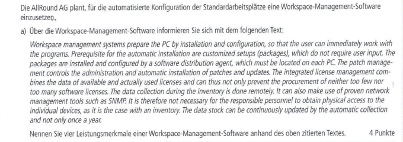

# 
## AP1 Frühjahr 2022 Aufgabe Nr 4

## Bearbeitet von [Amanda Peeler](<../../../user/Auszubildende Michel/peeler.md>)  & [Daniel Ullmann](<../../../user/Auszubildende Holldack/ullmann.md>)

### Themen:

* Englisch Verständnins
* Workspace Management Software
* Angebotskalkulation
* Datenübertragungsrate berechnen 

---

## Aufgaben:
  
  
  
  
  
  

----

## Test Aufgaben:

#### Test Aufgabe zu 4 a): 
Erläutern Sie anhand des oben zitierten Textes, welche Vorteile die Nutzung einer Workspace-Management-Software für die IT-Abteilung eines Unternehmens bietet.
Hinweis: Gehen Sie dabei auf Aspekte wie Effizienz, Zeitersparnis, Sicherheit und Lizenzmanagement ein.

#### Test Aufgabe zu 4 b): 
Erörtern Sie, wie die Entscheidung zwischen einer cloudbasierten und einer on-premises Workspace-Management-Software von den individuellen Anforderungen und der IT-Infrastruktur eines Unternehmens abhängt. Nennen Sie dabei mindestens drei Entscheidungsfaktoren.

#### Test Aufgabe zu 4 c):

Gegeben: 
Fremdbezug = 30,00 EUR pro Jahr pro Lizenz  
Eigenentwicklung = Personalaufwand von 14.000 Stunden  
Jährliche Wartung = 160 Stunden pro Jahr  
Mitarbeiter stundengehalt = 90 EUR 

#### Test Aufgabe zu 4 e):
Gegeben:  
Dateigröße = 200MiByte  
Download = 100Mbit/s   
Upload = 60 Mbit/s 

----

## Erarbeitete Lösungen der Aufgaben:

#### Lösung von [Amanda Peeler](solution/AP1_Fruehjahr_2022_Aufgabe4_Solution_Peeler.md) & [Daniel Ullmann](solution/AP1_2022_Frühjahr_Aufgabe_4_Ullmann.md)
----

## Links zu Themen:

- Hier werden Seiten verlinkt mit denen man die Themen lernen kann.
