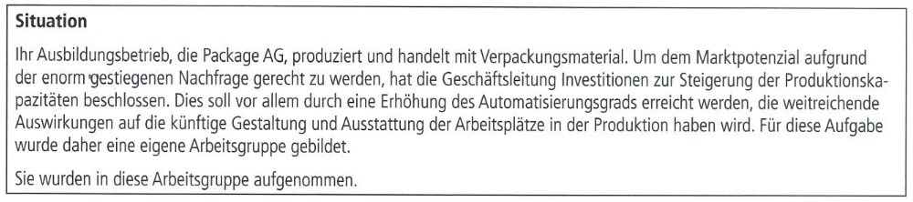
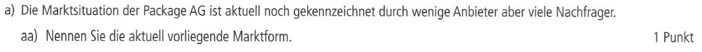
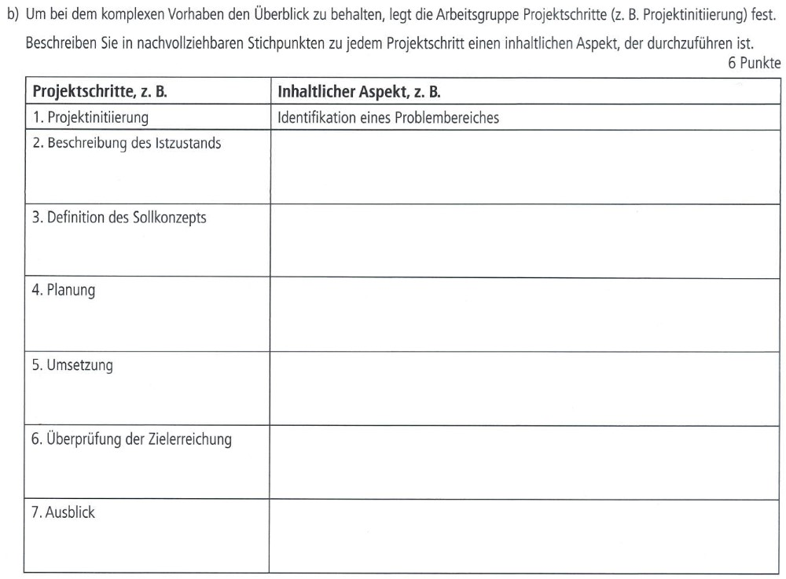
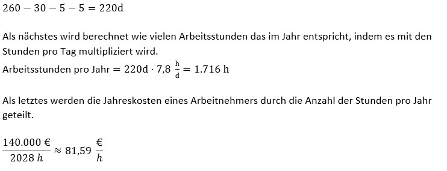

# 
## AP 1 Herbst 2022 A1 Lösung [Mia Rücker](<../../../../user/Auszubildende Michel/ruecker.md>)

## AP1 Aufgabe 1 aa)

## Lösung zur AP1 Aufgabe 1 aa)

Bei wenig Anbietern und großer Nachfrage ist die Marktform ein Angebotsoligopol.

## AP1 Aufgabe 1 ab)

## Lösung zur AP1 Aufgabe 1 ab)

Bei großer Nachfrage und großem Angebote ist es ein bilaterales (zweiseitiges) Polypol

## AP1 Aufgabe 1 b)

## Lösung zur AP1 Aufgabe 1 b)

## AP1 Aufgabe 1 c)

## Lösung zur AP1 Aufgabe 1 c)

1. Der Maschinenhersteller, welche für Installation, Konfiguration und Anfertigung dieser verantwortlich ist.
2. Das Projektteam, was für die Durchführung und Organisation des Projekts zuständig ist.
3. Aktionäre, die durch den Kauf von weiteren Aktien das Projekt mitfinanzieren.

## AP1 Aufgabe 1 d)

## Lösung zur AP1 Aufgabe 1 d)

Vorteile:
  - Können genau für die Projektdauer eingestellt werden und auf Abruf verfügbar sein.
  - Können neue, unkonventionelle Ideen in das Projekt reinbringen

Nachteile:
  - Stellen ein Sicherheitsrisiko dar, da sie firmeninterne Infos bekommen könnten.
  - Können weniger motiviert sein an dem Projekt zu arbeiten, da es ihren Job nicht gefährdet.
  - Stellen häufig nur Standardlösungen vor, die nicht immer funktionieren.

## AP1 Aufgabe 1 e)

## Lösung zur AP1 Aufgabe 1 e)

## AP1 Aufgabe 1 f)

## Lösung zur AP1 Aufgabe 1 f)

Mit dem Projektberater sollte ein Dienstvertrag abgeschlossen werden, da es sich hier um eine Dienstleistung handelt. Es werden keine Produkte angefertigt oder verändert.

## Selbsterstellte Aufgabe

## Lösung der Selbsterstellten Aufgabe

## Lösung zur AP1 Übungsaufgabe 1 aa)

Zweiseitiges Polypol

## Lösung zur AP1 Übungsaufgabe 1 ab)

Nachfrageoligopol

## Lösung zur AP1 Übungsaufgabe 1 b)

* Kreuzfahrtschiffbranche, da diese die zukünftigen Kunden sind.
* Die externe Firma, da diese die Software entwickeln.
* Die Gesellschafter der GmbH, die vom Projekt überzeugt werden müssen. 

## Lösung zur AP1 Übungsaufgabe 1 c)

Berechnung der Arbeitsstunden im Jahr:

260d-28d-4d-6d = 222 Tage

222d × 7,5 h/d = 1.665 Arbeitsstunden

effektiver Stundensatz = 130.000 € / 1.665 h = 180,18 €/h

## Lösung zur AP1 Übungsaufgabe 1 d)

Der Firma sollte ein Werkvertrag gestellt werden, da es sich um die Herrstellung eines Produkts handelt und nicht
um eine Dienstleistung.
