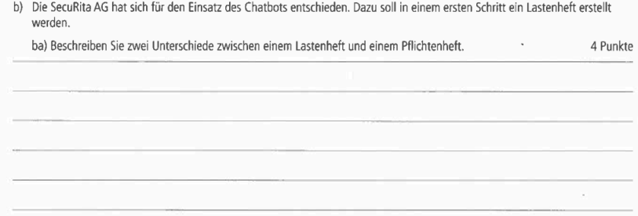

# 
## AP1 Frühjahr 2023 Aufgabe Nr 4

## Bearbeitet von [Amanda Peeler](<../../../user/Auszubildende Michel/peeler.md>)  & [Daniel Ullmann](<../../../user/Auszubildende Holldack/ullmann.md>)

### Themen:

* Vor und Nachteile KI Chatbot
* Lasten und Pflichten Heft
* Erstellung Klassenhierarchie
* SQL Abfragen

---

## Aufgaben:
  
  
  
  
  

----

## Test Aufgabe:

#### Test Aufgabe zu 4 a) 
Bewerten Sie, welche zusätzlichen Anforderungen an die Datensicherheit und den Datenschutz gestellt werden müssen, wenn ein KI-gestützter Chatbot für die Schadensregulierung eingesetzt wird. Begründen Sie, warum diese Anforderungen besonders wichtig sind.

#### Test Aufgabe zu 4 b) 
Erläutern Sie, welche Informationen und Anforderungen in das Lastenheft aufgenommen werden sollten, um die Entwicklung des Chatbots möglichst zielgerichtet und effizient zu gestalten.

----

## Erarbeitete Lösungen der Aufgaben:

#### Lösung von [Amanda Peeler](solution/AP1_Frühjahr_2023_Aufgabe4_Lösung_Peeler.md) & [Daniel Ullmann](solution/AP1_2023_Frühjahr_Aufgabe_4_Ullmann.md)

----

## Links zu Themen:

- Hier werden Seiten verlinkt mit denen man die Themen lernen kann.
