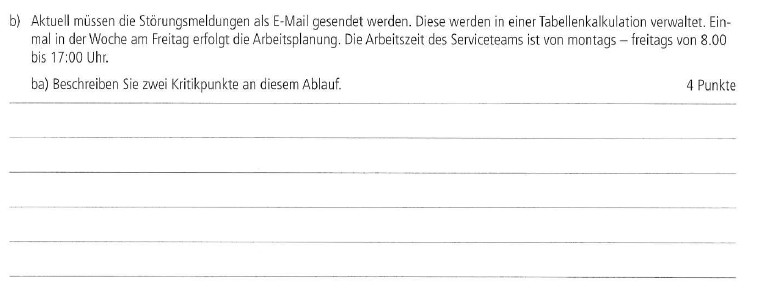

# 
## AP 1 Herbst 2023 A1 Lösung [Mia Rücker](<../../../../user/Auszubildende Michel/ruecker.md>)

## AP1 Aufgabe 1 a)

 

## Lösung zur AP1 Aufgabe 1 a)

 

## AP1 Aufgabe 1 ba)

 

## Lösung zur AP1 Aufgabe 1 ba)

1. Die Arbeitsplanung findet nur einmal in der Woche statt, wodurch neue relevante Probleme erst spät angegangen werden teils.

2. Bei großflächigen Störungen kann das E-Mail-Postfach schnell überfüllt sein mit Nachrichten von vielen Kunden auf das gleiche Problem, das schränkt die Übersichtlichkeit ein. 

## AP1 Aufgabe 1 bb)

 

## Lösung zur AP1 Aufgabe 1 bb)

Einführung eines Ticketsystems, in dem Prioritäten wie Fälligkeitsdaten für Aufgaben gesetzt werden. 
Einführung eines Chatbots, der außerhalb der Arbeitszeit bei Problemen mit seinen Möglichkeiten versuchen kann, dem Kunden zu helfen.

## AP1 Aufgabe 1 c)

 

## Lösung zur AP1 Aufgabe 1 c)

1. Durchführung einer Kundenbefragung
2. Analyse vorhandener Daten
3. Befragung von Fokusgruppen

## AP1 Aufgabe 1 da)

 

## Lösung zur AP1 Aufgabe 1 da)

Bei zu hohen Preisen kann der Kunde dazu neigen den Service abzulehnen, auch wenn dieser gut ist.

## AP1 Aufgabe 1 db)

 

## Lösung zur AP1 Aufgabe 1 db)

Bei zu niedrigen Preisen besteht die Gefahr, dass die eigenen Kosten nicht gedeckt werden können.

## AP1 Aufgabe 1 dc)

 

## Lösung zur AP1 Aufgabe 1 dc)

Die vier Aspekte sind:
1. Die Kalkulation der eigenen Kosten
2. Das Wissen um die eigene Kundschaft
3. Das Beobachten der Marktsituation
4.  Die Wahl eines Preismodells

## AP1 Aufgabe 1 e)

 

## Lösung zur AP1 Aufgabe 1 e)

1. Sachaspekt:
Das Preis-Leistungsverhältnis vom Service ist nicht gerechtfertigt.

2. Selbstaussage:
„Ich bin unzufrieden mit der Entscheidung über Ihre Preiserhöhung!“

3. Beziehungsaspekt:
Der Kunde überlegt das Geschäftsverhältnis zu beenden.

4. Appell:
Der Kunde will ein besseres Preis-Leistungsverhältnis haben.

## Selbsterstellte Aufgabe

## Lösung der Selbsterstellten Aufgabe

## Lösung zur AP1 Übungsaufgabe 1 a)

## Lösung zur AP1 Übungsaufgabe 1 ba)

 1. Durch fehlenden Kontakt zu einem Menschen können abgeschreckt sein ein Problem zu melden.
 2. Eine KI kann nur schwer eine ordentliche Priorisierung und Kategorisierung vornehmen.

## Lösung zur AP1 Übungsaufgabe 1 bb)

1. Bei jeder Anfrage wird ein Ticket zu dieser erstellt.
2. Die KI arbeitet unterstützend, aber nicht als Hauptträger des 1st Level Supports.

## Lösung zur AP1 Übungsaufgabe 1 ca)

Service wird als was kurzlebiges und etwas immaterielles beschrieben.

## Lösung zur AP1 Übungsaufgabe 1 cb)

Hohe Servicequalität führt zu loyaleren Kunden, die ihre positive Erfahrung mit dem Service verbreiten.

## Lösung zur AP1 Übungsaufgabe 1 cc)

1. Qualität ist, was Kunden die Erwartung eines Kunden zum Service übersteigt.
2. Qualität ist wenn der Service mit den Anforderungen übereinstimmt.
3. Qualität kann aus verschiedenen Blickwinkeln betrachtet werden. Z.B benutzbasiert oder produktbasiert.

## Lösung zur AP1 Übungsaufgabe 1 d)

1. Sachaspekt:
Ich bin unzufrieden mit eurem neuen KI-Chatbot und würde gerne mit einem Mitarbeiter reden.

2. Selbstaussage:
Ich bin gerade sehr frustriert und bringe meinem Unmut über den Service zum Ausdruck.

3. Beziehungsaspekt:
Die Person ist Kunde unseres Services und hat aktuell ein schlechtes Verhältnis zu uns.

4. Appell:
Bitte macht es möglich bei eurem Service mit Mitarbeitern zu kommunizieren anstelle von Bots.
